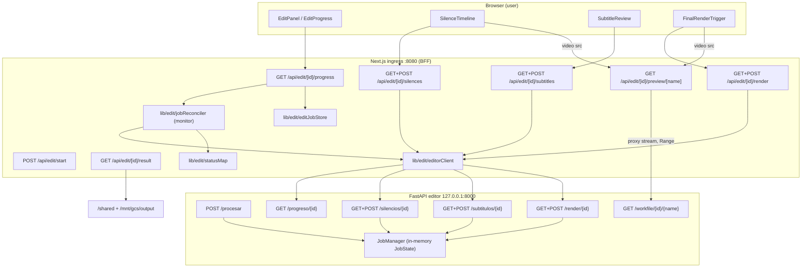
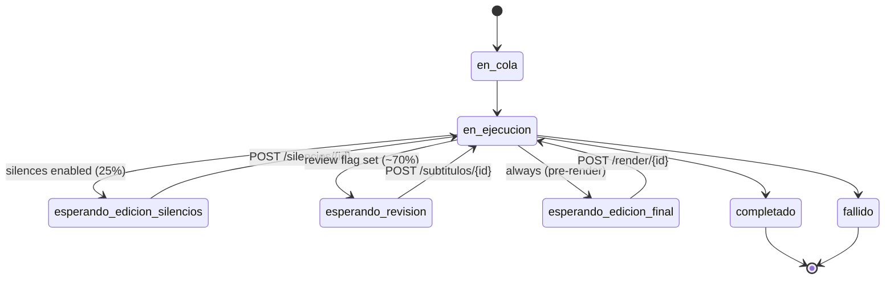
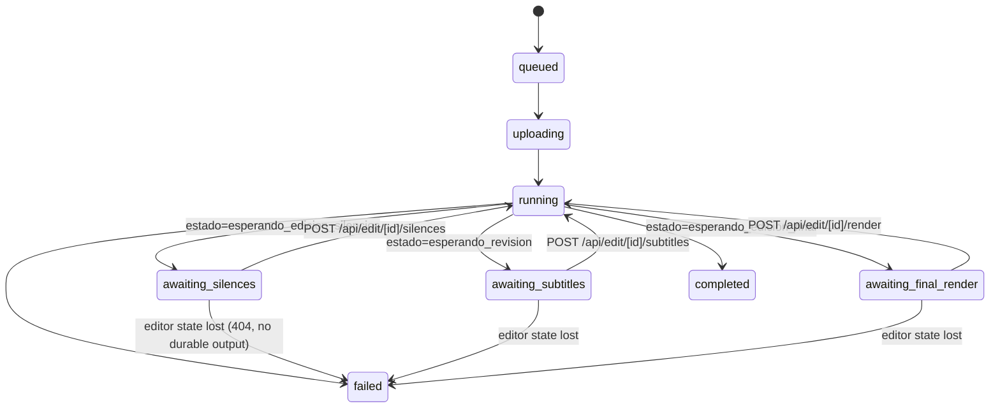
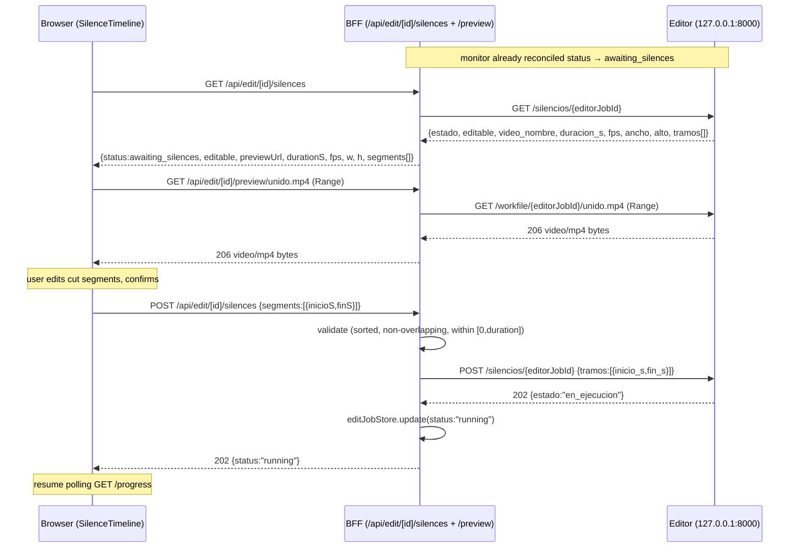

# Design Document: manual-edit-integration

## Overview

The generator's "Enviar al editor" flow currently assumes the editor is a fully
automatic pipeline: `EditPanel`/`EditProgress` start a job, poll
`GET /api/edit/[editJobId]/progress`, and show a progress bar until the durable
result appears. But the editor (`editor/app/engine/pipeline.py`) is an
**interactive shorts editor with mandatory human-in-the-loop pauses**. When the
pipeline pauses, the editor reports one of three Spanish `estado` values
(`esperando_edicion_silencios`, `esperando_revision`, `esperando_edicion_final`).
Today `src/lib/edit/statusMap.ts` collapses **all three** to a single
`awaiting_edit` status, and the UI shows a static "Esperando confirmación
manual..." message with no controls. The generic `POST /api/edit/[editJobId]/confirm`
route even calls a non-existent editor endpoint (`/confirmar/{id}`). The result:
the integration hangs at the first pause with no way for the user to act.

This feature makes the manual pauses first-class in the generator. It (1)
splits the collapsed `awaiting_edit` status into three explicit, actionable
generator statuses (`awaiting_silences`, `awaiting_subtitles`,
`awaiting_final_render`); (2) adds BFF pass-through routes that fetch each
pause's payload from the editor and forward the user's edited confirmations to
the editor's existing resume endpoints (`/silencios/{id}`, `/subtitulos/{id}`,
`/render/{id}`); (3) adds three UI components (silence-editing timeline,
subtitle-review editor, final-render trigger) that `EditProgress` swaps in as
the job transitions through the awaiting states; and (4) serves the editor's
intermediate `unido.mp4`/`cortado.mp4` for in-browser preview via a BFF proxy of
the editor's `GET /workfile/{job_id}/{name}` (the editor binds to
`127.0.0.1:8000` and is not browser-reachable in the combined Cloud Run
container).

The design is **additive and non-breaking**: the editor Python service is
unchanged (all its endpoints, states, and tests are preserved); automatic
behavior is preserved (when a pause does not apply — silences disabled, no
subtitle-review flag — the editor never enters that awaiting state and the UI
simply keeps polling); and the existing `EditJob` entity, `/start`, `/progress`,
`/result`, and `/api/edit` list routes keep their contracts. The deprecated
generic `/confirm` route is superseded by the three typed pass-through routes.

---

## Architecture

### Deployment topology (cloud mode)

Single combined Cloud Run container `videogeneradorxd`:
- **Next.js ingress** on `:8080` — serves the browser UI and the BFF (`/api/edit/*`).
- **FastAPI editor** on `127.0.0.1:8000` — internal only, reached over loopback.
- `EDIT_MODE=cloud`, `VSE_STORAGE_BACKEND=volume`. Clips exchanged via `/shared`
  (`edit-io/<editJobId>/...`); durable output under `/mnt/gcs/output/edit-output`.

The browser can only reach the Next.js process. Every editor interaction —
including preview video bytes — must flow through the BFF.



### The pause-state machine (editor pipeline)

Confirmed step/percentage map and pause points (from
`editor/app/engine/pipeline.py`, `models/job.py`):

| Step | % range | Pause? | Editor estado when paused | Resume endpoint |
|------|---------|--------|---------------------------|-----------------|
| UNIR | 0–25 | no | — | — |
| CORTAR_SILENCIOS | 25–40 | **yes, if silences enabled** — detects silence segments on the joined video, pauses at 25% | `esperando_edicion_silencios` | `POST /silencios/{id}` |
| TRANSCRIBIR | 40–70 | no | — | — |
| (subtitle review) | ~70 | **yes, if `aprobar_a_mano` or (`revisar` and IA off)** | `esperando_revision` | `POST /subtitulos/{id}` |
| SUBTITULOS prep | ~70–90 | **always pauses** for final edit + render-engine choice | `esperando_edicion_final` | `POST /render/{id}` |
| (Remotion render) | on resume | no | — | — |
| MUSICA | 90–100 | no | — | — |
| done | 100 | terminal | `completado` | — |
| error | any | terminal | `fallido` | — |



### Generator-side state machine (target)

The generator mirrors the editor estados but with **distinct actionable
statuses** instead of the single collapsed `awaiting_edit`. This is the core
change enabling the UI to act.



### Sequence: silence-editing round trip



The subtitle and final-render round trips follow the same shape against
`/subtitulos/{id}` and `/render/{id}` respectively.

---

## Components and Interfaces

### Component 1: `statusMap` (extended) — `src/lib/edit/statusMap.ts`

**Purpose**: Map each editor `estado` to a distinct generator status instead of
collapsing the three awaiting estados to one.

**Change**: Extend the `EditJobStatus` union and the `ESTADO_MAP`.

```typescript
// types.ts — extend the union (was: ... | "awaiting_edit" | ...)
export type EditJobStatus =
  | "queued"
  | "uploading"
  | "running"
  | "awaiting_silences"      // editor: esperando_edicion_silencios
  | "awaiting_subtitles"     // editor: esperando_revision
  | "awaiting_final_render"  // editor: esperando_edicion_final
  | "completed"
  | "failed";

// statusMap.ts
const ESTADO_MAP: Record<string, EditJobStatus> = {
  en_cola: "queued",
  en_ejecucion: "running",
  esperando_edicion_silencios: "awaiting_silences",
  esperando_revision: "awaiting_subtitles",
  esperando_edicion_final: "awaiting_final_render",
  completado: "completed",
  fallido: "failed",
};
```

**Responsibilities**:
- Total function: every known editor estado maps to exactly one generator status.
- Unknown estado → `failed` with `{paso:"STATUS_MAPPING", motivo}` (unchanged).
- Comparison remains case-insensitive/trimmed.

**Migration note**: `awaiting_edit` is removed. Any UI/test referencing it must
switch to the three new statuses. The deprecated generic `confirm` route is
removed (superseded by typed routes).

### Component 2: `editorClient` (extended) — `src/lib/edit/editorClient.ts`

**Purpose**: Typed HTTP client to the editor sidecar. Adds the six pause
endpoints plus a raw workfile proxy fetch. No auth headers (loopback-internal,
consistent with existing `procesar`/`progreso`).

**Interface** (added methods; keep retry/timeout/error-classification behavior):

```typescript
interface EditorClient {
  baseUrl: string;
  procesar(req: EditorProcesarRequest): Promise<ProcesarResponse>;
  progreso(editorJobId: string): Promise<EditorProgress>;

  // NEW — read pause payloads
  getSilencios(editorJobId: string): Promise<EditorSilenciosResponse>;
  getSubtitulos(editorJobId: string): Promise<EditorSubtitulosResponse>;
  getRender(editorJobId: string): Promise<EditorRenderResponse>;

  // NEW — forward confirmations (editor returns 202)
  postSilencios(editorJobId: string, body: { tramos: EditorTramo[] }): Promise<void>;
  postSubtitulos(editorJobId: string, body: { grupos: { texto: string }[] }): Promise<void>;
  postRender(editorJobId: string, body: EditorRenderConfirmBody): Promise<void>;

  // NEW — proxy intermediate video for preview (Range-aware, streaming)
  fetchWorkfile(editorJobId: string, name: string, range?: string): Promise<Response>;
}
```

**Responsibilities**:
- `getX` GETs the editor read-only pause contract and returns it verbatim.
- `postX` POSTs the confirmation; treats non-2xx via existing
  `EditorPermanentError` (4xx) / `EditorTransientError` (5xx/network) so callers
  map editor 400/409/404 to BFF responses.
- `fetchWorkfile` performs a raw `fetch` (no JSON parsing) passing through the
  `Range` request header and returning the editor `Response` so the BFF can
  stream/forward status 200/206 and headers.

### Component 3: BFF pass-through routes (new)

Under `src/app/api/edit/[editJobId]/`:

- `silences/route.ts` — `GET` (fetch segments + preview ref), `POST` (confirm cuts)
- `subtitles/route.ts` — `GET` (fetch proposed groups), `POST` (confirm edited text)
- `render/route.ts` — `GET` (fetch final preview + extra texts), `POST` (trigger render)
- `preview/[name]/route.ts` — `GET` (proxy editor `/workfile`, Range-aware)

Each mirrors the DI pattern already used (`_deps.ts` with `getDeps`, `editJobStore`,
`createClient`). See "Key Functions" for signatures and pseudocode.

**Responsibilities (all typed routes)**:
- Look up `EditJob` by `editJobId`; 404 if missing.
- Resolve `editorJobId = job.editorJobId`; 409 if null (job never accepted).
- Guard the generator `status` matches the route (e.g. `/silences` requires
  `awaiting_silences`); 409 otherwise.
- Forward to the editor; on 202 transition `status → running`; on editor 4xx
  keep the awaiting status and surface details; on 404 from a lost in-memory
  job, run the recoverable-error path (see Error Handling).

### Component 4: `EditProgress` (extended) + three edit components — `src/components/edit/`

**Purpose**: Render the correct control surface per status; keep the existing
progress bar and download for terminal/running states.

- `EditProgress` (extended): switch on `status`. For `awaiting_silences` mount
  `SilenceTimeline`; `awaiting_subtitles` mount `SubtitleReview`;
  `awaiting_final_render` mount `FinalRenderTrigger`. Otherwise show the bar
  (running/queued/uploading), the download link (completed), or the error box
  (failed). After a confirmation returns 202, resume the 2s poll loop.
- `SilenceTimeline` (new): fetches `GET /api/edit/[id]/silences`, renders the
  joined-video `<video>` from the `previewUrl`, overlays the detected cut
  segments on a timeline, lets the user add/remove/move/resize cut ranges, and
  `POST`s the edited segments. Client-side validation mirrors the server
  (sorted, non-overlapping, `0 ≤ inicioS < finS ≤ durationS`).
- `SubtitleReview` (new): fetches `GET /api/edit/[id]/subtitles`, renders one
  editable text field per proposed group (timings shown read-only — the editor
  contract only accepts edited **text** and preserves timings/word-timings),
  and `POST`s `{groups:[{texto}]}` with the same group count.
- `FinalRenderTrigger` (new): fetches `GET /api/edit/[id]/render`, optionally
  previews the cut video with subtitle overlay, lets the user add up to 2 extra
  "hook" texts, and `POST`s `{textos_extra, motor:"remotion"}` to start render.

**Consistency**: same Tailwind panel styling, `parse*Response` helpers in
`editUiData.ts`, `apiErrorMessage` for error surfacing, and `"use client"`
components as the existing `EditPanel`.

---

## Data Models

All editor-side shapes are taken verbatim from the inspected FastAPI endpoints;
generator-side shapes are the normalized (camelCase) forms the UI consumes.

### Editor read/confirm contracts (verbatim, snake_case)

```typescript
// GET /silencios/{id}
interface EditorSilenciosResponse {
  job_id: string;
  estado: string;               // e.g. "esperando_edicion_silencios"
  editable: boolean;            // true only when awaiting silences
  video_url: string | null;     // editor-internal http://BACKEND_HOST:PORT/workfile/...
  video_nombre: string | null;  // e.g. "unido.mp4"
  duracion_s: number;           // duration of joined video (0.0 if unknown)
  fps: number; ancho: number; alto: number;
  tramos: { inicio_s: number; fin_s: number }[];  // detected cut segments
}
type EditorTramo = { inicio_s: number; fin_s: number };

// GET /subtitulos/{id}
interface EditorSubtitulosResponse {
  job_id: string;
  estado: string;
  editable: boolean;            // true only when awaiting revision
  grupos: EditorGrupo[];
}
interface EditorGrupo {         // GrupoSubtitulo.model_dump()
  texto: string;
  inicio_s: number;
  fin_s: number;
  palabras: { texto: string; inicio_s: number | null; fin_s: number | null }[] | null;
}

// GET /render/{id}
interface EditorRenderResponse {
  job_id: string;
  estado: string;
  editable: boolean;            // true only when awaiting final edit
  motor_preferido: string;      // retained for back-compat; UI ignores
  grupos: EditorGrupo[];        // final groups (grouped + AI-corrected)
  video_url: string | null;     // cut video (cortado.mp4)
  video_nombre: string | null;
  fps: number; ancho: number; alto: number;
  duracion_s: number | null;    // best-effort; may be null
  textos_extra: EditorTextoExtra[];
}
interface EditorTextoExtra {    // TextoExtra.model_dump()
  texto: string;
  inicio_s: number;
  fin_s: number;
  estilo: {
    fuente: string; tamano: number; color: string; color_borde: string;
    grosor_borde: number; negrita: boolean;
    pos_vertical_pct: number; pos_horizontal_pct: number;
  };
}
interface EditorRenderConfirmBody {
  textos_extra: EditorTextoExtra[];  // max 2
  motor?: "remotion";                // omitted → remotion (editor default)
}
```

### Generator-normalized pause views (camelCase, what the UI consumes)

```typescript
interface SilencesView {
  status: "awaiting_silences";
  editable: boolean;
  previewUrl: string | null;   // BFF proxy: /api/edit/{id}/preview/{video_nombre}
  durationS: number;
  fps: number; width: number; height: number;
  segments: { inicioS: number; finS: number }[];
}

interface SubtitlesView {
  status: "awaiting_subtitles";
  editable: boolean;
  groups: { texto: string; inicioS: number; finS: number }[]; // timings read-only
}

interface FinalRenderView {
  status: "awaiting_final_render";
  editable: boolean;
  previewUrl: string | null;   // BFF proxy of cortado.mp4
  durationS: number | null;
  fps: number; width: number; height: number;
  groups: { texto: string; inicioS: number; finS: number }[];
  extraTexts: EditorTextoExtra[];
}
```

**Validation Rules (silence segments, enforced BFF-side and mirrored client-side):**
- Each segment: `inicioS` and `finS` finite numbers, `0 ≤ inicioS < finS`.
- All segments within the joined-video duration: `finS ≤ durationS`.
- Segments sorted ascending by `inicioS` and pairwise non-overlapping
  (`segment[i].finS ≤ segment[i+1].inicioS`).
- The editor re-validates with `validar_tramos_silencio(duracion)`; the BFF
  pre-validates to fail fast with a clear message (defense in depth).

**Validation Rules (subtitles):**
- The submitted group count MUST equal the proposed group count (editor rejects
  otherwise; edits are text-only, cannot add/remove lines).
- No group text may be empty after trim.

**Validation Rules (final render):**
- At most 2 extra texts; each `0 ≤ inicio_s < fin_s`; style within editor ranges
  (editor validates via `validar_texto_extra`). `motor` if present must equal
  exactly `"remotion"`.

### `EditJob` (unchanged shape; wider `status` domain)

`EditJob` in `src/lib/edit/types.ts` keeps all fields; only the `status` union
widens to include the three awaiting statuses. `editorJobId` remains the
mapping key between the generator `editJobId` and the editor `job_id`.

---

## Algorithmic Pseudocode

### Reconciler status mapping (jobReconciler.ts, extended)

The reconciler already GETs `/progreso/{id}`, applies percent monotonicity, and
maps `estado`. With the extended `ESTADO_MAP`, the three awaiting statuses flow
through automatically. Two additions are required: (a) treat the new awaiting
statuses as non-terminal live states (already the default), and (b) the
recoverable-error path when a paused job's editor state is lost.

```typescript
ALGORITHM reconcileEditJob(editJobId, deps)
  job ← deps.store.get(editJobId)
  IF job is null THEN RETURN undefined
  IF job.status IN {completed, failed} THEN RETURN {job, live:true}

  durable ← detectDurableOutput(job, deps)        // unchanged: output-first
  IF durable THEN RETURN {job:durable, live:true}

  IF job.editorJobId is null THEN RETURN {job, live:true}

  TRY raw ← deps.client.progreso(job.editorJobId)
  CATCH EditorPermanentError e:
    IF e.statusCode == 404 THEN
      // In-memory editor job lost (container restart). Output-first already ran.
      recovered ← detectDurableOutput(job, deps)
      IF recovered THEN RETURN {job:recovered, live:true}
      reason ← job.status starts with "awaiting_"
        ? "Editor was restarted and the paused edit state was lost. Re-run the edit."
        : "Editor job state was lost and no durable final.mp4 exists"
      RETURN failJob(job, {paso:"PROGRESO", motivo:reason}, live:false, message:reason)
    ELSE RETURN failJob(job, {paso:"PROGRESO", motivo:"Editor rejected reconciliation"}, live:false)
  CATCH transient:
    RETURN {job, live:false, message:"Live progress temporarily unavailable"}

  status ← ESTADO_MAP[raw.estado]  (via mapEditorEstado)  // now yields awaiting_* distinctly
  porcentaje ← max(job.progress.porcentaje, clamp(floor(raw.porcentaje), 0, 100))
  IF status == completed THEN
    completed ← detectDurableOutput(job, deps)
    IF completed THEN RETURN {job:completed, live:true}
    status ← failed; error ← {paso:"OUTPUT", motivo:"completed but durable final.mp4 unavailable"}
  patch ← {status, progress:{porcentaje, pasoActual:raw.paso_actual, mensaje:raw.mensaje,
                             error: status==failed ? error : null}}
  RETURN {job: deps.store.update(editJobId, patch), live:true}
```

**Preconditions:** `deps.store` and `deps.client` available; `editJobId` may or
may not exist. **Postconditions:** returned job's `status` is one of the 8 known
statuses; percent never decreases (monotonic); a lost paused job surfaces an
actionable failure, never a silent hang. **Loop invariants:** N/A (the monitor
loop already backs off; unchanged).

### BFF pass-through: POST /api/edit/[editJobId]/silences

```typescript
ALGORITHM POST_silences(req, {editJobId})
  deps ← getDeps()
  job ← deps.store.get(editJobId)
  IF job is null THEN RETURN 404 {error}
  IF job.editorJobId is null THEN RETURN 409 {error:"no editor job id"}
  IF job.status != "awaiting_silences" THEN
    RETURN 409 {error:`expected awaiting_silences, got ${job.status}`}

  body ← parseJson(req)                              // {segments:[{inicioS,finS}]}
  IF body invalid shape THEN RETURN 400
  // Fetch duration for validation (source of truth is the editor pause payload)
  sil ← deps.client.getSilencios(job.editorJobId)    // has duracion_s
  errs ← validateSegments(body.segments, sil.duracion_s)
  IF errs not empty THEN RETURN 400 {error:"invalid cut segments", details:errs}

  tramos ← body.segments.map(s => ({inicio_s:s.inicioS, fin_s:s.finS}))
  TRY deps.client.postSilencios(job.editorJobId, {tramos})   // editor 202
  CATCH EditorPermanentError e:                       // editor 400/409/404
    IF e.statusCode == 404 THEN RETURN recoverableLost(editJobId, deps)
    RETURN 400 {error:"Editor rejected silence edit", details:e.body, status:"awaiting_silences"}
  CATCH transient e:
    RETURN 502 {error:"Editor unavailable", status:"awaiting_silences"}

  deps.store.update(editJobId, {status:"running",
      progress:{...job.progress, mensaje:"Resumed after silence edit", error:null}})
  RETURN 202 {editJobId, status:"running"}
```

**Preconditions:** job exists, is awaiting silences, has an `editorJobId`.
**Postconditions:** on success status is `running` and the editor is resuming;
on any error branch the job status is unchanged (stays `awaiting_silences`) —
except editor-404, which routes to the recoverable-lost path. **The route never
leaves the job in an awaiting state without either advancing it or returning an
actionable error.**

`validateSegments` is the shared invariant:

```typescript
ALGORITHM validateSegments(segments, durationS)
  errors ← []
  prevFin ← 0
  FOR i, s IN enumerate(segments):
    IF not finite(s.inicioS) or not finite(s.finS) THEN errors.push({i,"non-numeric"}); CONTINUE
    IF not (0 ≤ s.inicioS < s.finS) THEN errors.push({i,"require 0 ≤ inicioS < finS"})
    IF s.finS > durationS THEN errors.push({i,"exceeds duration"})
    IF s.inicioS < prevFin THEN errors.push({i,"overlaps or not sorted"})
    prevFin ← s.finS
  RETURN errors
```

### BFF pass-through: POST /api/edit/[editJobId]/subtitles

```typescript
ALGORITHM POST_subtitles(req, {editJobId})
  deps ← getDeps(); job ← deps.store.get(editJobId)
  IF job is null THEN RETURN 404
  IF job.editorJobId is null THEN RETURN 409
  IF job.status != "awaiting_subtitles" THEN RETURN 409

  body ← parseJson(req)                              // {groups:[{texto}]}
  IF any group.texto empty after trim THEN RETURN 400 {error:"empty group text", indices}
  grupos ← body.groups.map(g => ({texto: g.texto.trim()}))

  TRY deps.client.postSubtitulos(job.editorJobId, {grupos})
  CATCH EditorPermanentError e:                       // e.g. count mismatch → 400
    IF e.statusCode == 404 THEN RETURN recoverableLost(editJobId, deps)
    RETURN 400 {error:"Editor rejected subtitle edit", details:e.body, status:"awaiting_subtitles"}
  CATCH transient: RETURN 502 {status:"awaiting_subtitles"}

  deps.store.update(editJobId, {status:"running",
      progress:{...job.progress, mensaje:"Resumed after subtitle review", error:null}})
  RETURN 202 {editJobId, status:"running"}
```

Note: the editor preserves per-word timings and group timings; only text is
edited. Group count must match — the UI never adds/removes lines.

### BFF pass-through: POST /api/edit/[editJobId]/render

```typescript
ALGORITHM POST_render(req, {editJobId})
  deps ← getDeps(); job ← deps.store.get(editJobId)
  IF job is null THEN RETURN 404
  IF job.editorJobId is null THEN RETURN 409
  IF job.status != "awaiting_final_render" THEN RETURN 409

  body ← parseJson(req)                              // {extraTexts?:[...], motor?:"remotion"}
  IF body.extraTexts and length > 2 THEN RETURN 400 {error:"max 2 extra texts"}
  payload ← { textos_extra: (body.extraTexts ?? []), motor: "remotion" }

  TRY deps.client.postRender(job.editorJobId, payload)
  CATCH EditorPermanentError e:                       // invalid text/style/motor → 400
    IF e.statusCode == 404 THEN RETURN recoverableLost(editJobId, deps)
    RETURN 400 {error:"Editor rejected render", details:e.body, status:"awaiting_final_render"}
  CATCH transient: RETURN 502 {status:"awaiting_final_render"}

  deps.store.update(editJobId, {status:"running",
      progress:{...job.progress, mensaje:"Final render started", error:null}})
  RETURN 202 {editJobId, status:"running"}
```

### BFF preview proxy: GET /api/edit/[editJobId]/preview/[name]

Decision: **the BFF proxies the editor's `GET /workfile/{job_id}/{name}`** rather
than reading `/shared` directly. Rationale: the editor already implements
workfile containment (`JobWorkdir.resolve` rejects path traversal) and knows the
per-job workdir layout; proxying reuses that safety, works identically in local
and cloud modes, and avoids duplicating the workdir path convention in Node. The
editor `video_url` (which points at the internal `BACKEND_HOST:PORT`) is **not**
sent to the browser; the BFF rewrites it to `previewUrl =
/api/edit/{editJobId}/preview/{video_nombre}`.

```typescript
ALGORITHM GET_preview(req, {editJobId, name})
  deps ← getDeps(); job ← deps.store.get(editJobId)
  IF job is null THEN RETURN 404
  IF job.editorJobId is null THEN RETURN 409
  IF name not in allowlist {"unido.mp4","cortado.mp4"} or contains "/" or ".."
     THEN RETURN 400                                  // defense in depth
  range ← req.headers.get("range")
  TRY res ← deps.client.fetchWorkfile(job.editorJobId, name, range)  // passes Range
  CATCH transient: RETURN 502
  IF res.status == 404 THEN RETURN 404
  // Forward status (200/206), Content-Type, Content-Length, Content-Range,
  // Accept-Ranges; stream the body through. Cache-Control: no-store.
  RETURN streamResponse(res)
```

**Preconditions:** job exists with editor job id; `name` allowlisted.
**Postconditions:** returns `video/mp4` (200 or 206) suitable for the `<video>`
element's Range requests, or an actionable 4xx/5xx. Auth: same posture as
existing `/result` and `/progress` routes (the BFF is the only browser-facing
surface; the editor stays loopback-internal, no OIDC token attached).

### UI transition (EditProgress, extended)

```typescript
ALGORITHM EditProgress.render(status, progress)
  SWITCH status:
    CASE "awaiting_silences":       RETURN <SilenceTimeline editJobId onResumed={restartPoll}/>
    CASE "awaiting_subtitles":      RETURN <SubtitleReview  editJobId onResumed={restartPoll}/>
    CASE "awaiting_final_render":   RETURN <FinalRenderTrigger editJobId onResumed={restartPoll}/>
    CASE "completed":               RETURN <DownloadLink/> + bar(100%)
    CASE "failed":                  RETURN <ErrorBox error/>
    DEFAULT (queued|uploading|running): RETURN <ProgressBar percent step message/>

// Poll loop (unchanged 2s cadence): on each tick GET /api/edit/{id}/progress,
// setStatus/progress; stop only on completed|failed. When status becomes an
// awaiting_* value the matching component mounts and takes over; after its
// confirmation returns 202 (status→running) the child calls onResumed() which
// re-arms the poll loop.
```

**No-silent-hang guarantee (UI):** the `DEFAULT` branch renders a progress bar,
each `awaiting_*` branch renders an actionable control, `failed` renders an
error with the `{paso,motivo}` reason, and `completed` renders the download.
Every reachable status yields either a control or an actionable message.

---

## Key Functions with Formal Specifications

### `mapEditorEstado(estado: string): { status; error }`

**Preconditions:** `estado` is any string.
**Postconditions:** returns exactly one of the 8 statuses; the three editor
awaiting estados map to `awaiting_silences` / `awaiting_subtitles` /
`awaiting_final_render` respectively; unknown estado → `failed` with a non-null
`error`. Total and deterministic; case-insensitive.

### `recoverableLost(editJobId, deps): Response`

**Preconditions:** an editor call returned 404 for a job the generator believes
is paused/running. **Postconditions:** runs an output-first `detectDurableOutput`
re-check; if a durable `final.mp4` exists, transitions to `completed` and returns
200; otherwise transitions to `failed` with `{paso:"EDITOR_STATE_LOST", motivo:
"Editor restarted; paused edit state lost — re-run the edit"}` and returns 409
(actionable), never leaving the job silently awaiting.

### `fetchWorkfile(editorJobId, name, range?): Response`

**Preconditions:** editor reachable on loopback. **Postconditions:** returns the
editor's raw `Response` (200/206/404) with headers intact; forwards `Range`;
performs no JSON parsing. No side effects on job state.

---

## Correctness Properties

Universal-quantification statements the implementation must satisfy; these seed
the property-based tests.

1. **State-machine totality (every awaiting estado is actionable).**
   ∀ estado ∈ editor `JobStatus` values:
   `mapEditorEstado(estado).status` is defined, and if estado ∈
   {`esperando_edicion_silencios`, `esperando_revision`, `esperando_edicion_final`}
   then the mapped status ∈ {`awaiting_silences`, `awaiting_subtitles`,
   `awaiting_final_render`} — a status the UI has a mounted control for.
   *No editor awaiting estado maps to a control-less status.*

2. **Confirmation round-trip advances the job.**
   ∀ valid confirmation C submitted to `/silences`|`/subtitles`|`/render` while
   the job is in the matching `awaiting_*` status, if the editor responds 202
   then the resulting generator `status = "running"` and the editor job leaves
   its awaiting estado. (Editor already returns `en_ejecucion` on 202.)

3. **Segment integrity is preserved and validated.**
   ∀ segment list S accepted by `POST /silences`: S is sorted ascending by
   `inicioS`, pairwise non-overlapping, and ∀ s ∈ S: `0 ≤ s.inicioS < s.finS ≤
   durationS`. Any S violating this is rejected with 400 and the job status is
   unchanged. The list forwarded to the editor equals S mapped 1:1 to
   `{inicio_s, fin_s}` (order and values preserved).

4. **Subtitle edit preserves structure.**
   ∀ submitted groups G to `/subtitles`: `|G|` equals the proposed group count
   and every `G[i].texto` is non-empty after trim, else 400; on success only
   text changes — group timings and per-word timings are those returned by the
   editor (the generator never sends timings).

5. **No silent hang.**
   ∀ reachable generator `status`: `EditProgress` renders either an interactive
   control (`awaiting_*`), a live progress bar (`queued|uploading|running`), a
   download (`completed`), or an error message (`failed`). And: any editor 404
   encountered while paused/running resolves to `completed` (durable output
   found) or `failed` with an actionable reason — never an indefinite
   awaiting/running with no message.

6. **Automatic behavior preserved.**
   ∀ jobs where a pause does not apply (silences disabled ⇒ no
   `esperando_edicion_silencios`; no review flag ⇒ no `esperando_revision`):
   the generator never enters the corresponding `awaiting_*` status and the poll
   loop proceeds `running → … → completed` exactly as before this feature.

7. **Preview confinement.**
   ∀ requests to `/preview/[name]`: `name` is one of the allowlisted intermediate
   filenames and contains no path separators or `..`; otherwise 400. The editor's
   `JobWorkdir.resolve` provides the second containment layer.

8. **Percent monotonicity across pauses.**
   ∀ reconcile sequences: the persisted `progress.porcentaje` is non-decreasing
   and clamped to `[0,100]`, including across the pause→resume transitions
   (inherited from the editor `JobManager` monotonic guarantee and the
   reconciler's `max(...)`).

---

## Error Handling

### Scenario: editor rejects a confirmation (400/409)
**Condition:** editor returns `INVALID_REQUEST` (bad segments/text/style/motor)
or `CONFLICT` (not in the expected awaiting estado).
**Response:** BFF returns 400 with `details` from the editor body; job status
stays in the current `awaiting_*` value (unchanged).
**Recovery:** UI shows `apiErrorMessage(details)` inline; the user corrects the
edit and resubmits. A 409 typically means status drift — the UI re-fetches
`/progress` to resync.

### Scenario: editor in-memory job lost on container restart
**Condition:** editor returns 404 for a job the generator thinks is paused
(the FastAPI `JobManager` is in-memory; a Cloud Run restart drops it).
**Response:** `recoverableLost` runs output-first detection; if durable
`final.mp4` exists → `completed`/200; else `failed`/409 with `{paso:
"EDITOR_STATE_LOST", motivo:"Editor restarted; paused edit state lost — re-run
the edit."}`.
**Recovery:** UI shows the actionable message and offers "Enviar al editor"
again (a fresh job). No silent hang.

### Scenario: editor unreachable / transient (5xx, network, timeout)
**Condition:** `EditorTransientError` on GET or POST pass-through.
**Response:** GET pause routes return 502 `{message:"Live progress temporarily
unavailable"}`, keeping the current status; POST routes return 502 keeping the
`awaiting_*` status. The monitor's exponential backoff continues.
**Recovery:** UI keeps polling; the pause control remains available to retry.

### Scenario: preview bytes unavailable
**Condition:** editor `/workfile` returns 404 (file not yet written / job gone).
**Response:** `/preview` returns 404; the `<video>` shows a "preview
unavailable" placeholder but the edit controls remain usable (segments/text can
still be confirmed using numeric ranges).
**Recovery:** retry after next poll; preview is best-effort, not blocking.

### Scenario: malformed request body to a pass-through route
**Condition:** invalid JSON or wrong shape.
**Response:** 400 with a specific message; status unchanged.

---

## Testing Strategy

### Unit testing
- `statusMap`: table test mapping every editor estado (incl. the three awaiting)
  to the expected generator status; unknown estado → failed.
- Each pass-through route with injected `_deps` (mock `editJobStore` +
  `editorClient`): 404/409 guards, happy-path 202→running, editor-4xx keeps
  awaiting, editor-404 → recoverable path, transient → 502.
- `validateSegments`: sorted/overlap/bounds/non-numeric cases.
- Preview route: allowlist/traversal rejection; Range passthrough; 404 mapping.
- Components (React Testing Library): `EditProgress` mounts the right child per
  status; `SilenceTimeline`/`SubtitleReview`/`FinalRenderTrigger` submit the
  expected payloads and call `onResumed` on 202.

### Property-based testing
**Library:** `fast-check` (already used across `src/lib/edit/__tests__/*.pbt.test.ts`).
- **Property 1** (totality): for arbitrary estado strings drawn from the editor
  enum, `mapEditorEstado` yields a defined, control-backed status.
- **Property 3** (segment integrity): generate arbitrary segment lists; assert
  `validateSegments` accepts iff sorted, non-overlapping, in-bounds; and that
  accepted lists forward 1:1 to `{inicio_s,fin_s}` preserving order.
- **Property 2/5** (round-trip / no-hang): model-based test over a mock editor
  that transitions estados; assert every 202 advances to `running` and no
  reachable status leaves the UI without a control/message.
- Reuse existing `terminal-consistency.pbt.test.ts` style for reconciler
  monotonicity (Property 8).

### Integration testing
- Mock-editor integration test exercising the full loop: start → running →
  `awaiting_silences` → POST silences → running → `awaiting_final_render` →
  POST render → completed, verifying UI transitions and BFF forwarding.
- Editor-restart integration: after `awaiting_*`, simulate editor 404 and assert
  the recoverable-error surfaces (no hang).
- Preview streaming: assert 206 partial content and `Content-Range` passthrough.

---

## Performance Considerations

- Preview streaming proxies bytes through the Next.js process; forward Range
  requests so the browser fetches only needed chunks (the editor `/workfile`
  uses `FileResponse` which supports ranged reads). Use streaming (no full
  buffering) to keep memory bounded for large intermediates.
- Poll cadence stays at 2s in the UI and 2–15s backoff in the server monitor;
  awaiting states pause naturally (no extra editor load beyond `/progreso`).

## Security Considerations

- The editor remains loopback-only (`127.0.0.1:8000`); the browser reaches it
  only through the BFF. No editor endpoint is exposed publicly.
- Preview `name` is allowlisted (`unido.mp4`, `cortado.mp4`) and separator/`..`
  rejected before proxying; the editor adds a second containment layer via
  `JobWorkdir.resolve`.
- Pass-through routes reuse the existing auth posture of `/api/edit/*` (the
  `authGuard` used by the edit lib); no editor OIDC token is attached (internal).
- Confirmation bodies are validated (segments/text/extra-texts) before
  forwarding; the editor re-validates, so malformed input cannot corrupt state.

## Dependencies

- Existing: Next.js (App Router, `runtime="nodejs"`), FastAPI editor (unchanged),
  `fast-check`, `zod`, `VolumeStorageAdapter`/`LocalStorageAdapter`, existing
  `editJobStore`, `jobReconciler`, `editorClient`, `retry` helpers.
- No new runtime packages required. `@remotion/player` may optionally be used for
  the final-render preview overlay (already present in the sibling editor UI);
  otherwise a plain `<video>` element suffices for silence/subtitle previews.
- Editor endpoints consumed (all already implemented): `GET/POST /silencios/{id}`,
  `GET/POST /subtitulos/{id}`, `GET/POST /render/{id}`, `GET /workfile/{id}/{name}`,
  `GET /progreso/{id}`, `POST /procesar`.
