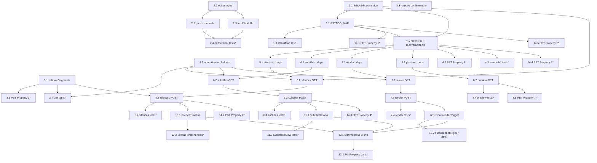

# Implementation Plan: manual-edit-integration

## Overview

This plan implements the design in `design.md` incrementally, in TypeScript on the
existing Next.js App Router + `src/lib/edit/*` + `src/components/edit/*` codebase.
It follows the repo conventions: App Router routes live under
`src/app/api/edit/[editJobId]/`, each route has a colocated `_deps.ts` DI module
(`getDeps` exposing `editJobStore` + `createClient`), shared logic lives in
`src/lib/edit/*`, client surfaces in `src/components/edit/*`, and tests in
colocated `__tests__/` folders using **vitest** with **fast-check** for
property-based tests (`*.pbt.test.ts`).

The sequence starts with the type/status foundation (so every downstream module
compiles against the widened `EditJobStatus`), then the editor client extensions,
then the BFF pass-through and preview routes, then the shared normalization and
validation helpers, then the UI components and `EditProgress` wiring, and finally
the property-based tests and a green-build checkpoint. The FastAPI editor
(`editor/`) is **unchanged**; the existing `/start`, `/progress`, `/result`, and
`/api/edit` list contracts are preserved.

## Tasks

- [x] 1. Widen the status domain and mapping (foundation)
  - [x] 1.1 Extend the `EditJobStatus` union in `src/lib/edit/types.ts`
    - Remove `awaiting_edit`; add `awaiting_silences`, `awaiting_subtitles`, `awaiting_final_render` to the union (final domain = exactly the 8 values)
    - Keep all other `EditJob` fields unchanged; only the `status` domain widens; `editorJobId` remains the generator↔editor mapping key
    - _Design: Component 1 (statusMap), Data Models (EditJob unchanged shape; wider status domain)_
    - _Requirements: 5.4_

  - [x] 1.2 Update `ESTADO_MAP` / `mapEditorEstado` in `src/lib/edit/statusMap.ts`
    - Map `esperando_edicion_silencios→awaiting_silences`, `esperando_revision→awaiting_subtitles`, `esperando_edicion_final→awaiting_final_render`; keep `en_cola→queued`, `en_ejecucion→running`, `completado→completed`, `fallido→failed`
    - Preserve trimmed/case-insensitive comparison and unknown-estado → `failed` with `{paso:"STATUS_MAPPING", motivo}`
    - _Design: Component 1 (statusMap), Key Functions (mapEditorEstado)_
    - _Requirements: 1.1, 2.1, 3.1, 5.1, 5.2, 5.3_

  - [x]* 1.3 Update `statusMap` table test in `src/lib/edit/__tests__/statusMap.test.ts`
    - Table test mapping every editor estado (incl. the three awaiting) to the expected generator status; assert `awaiting_edit` no longer produced; unknown estado → `failed` with non-null `{paso:"STATUS_MAPPING"}`
    - _Design: Testing Strategy (Unit testing → statusMap)_
    - _Requirements: 5.1, 5.2, 5.3, 5.4_

- [x] 2. Extend the editor client with pause + workfile methods
  - [x] 2.1 Add editor response/confirm types in `src/lib/edit/editorClient.ts`
    - Add verbatim snake_case types `EditorSilenciosResponse`, `EditorSubtitulosResponse`, `EditorRenderResponse`, `EditorGrupo`, `EditorTramo`, `EditorTextoExtra`, `EditorRenderConfirmBody`
    - _Design: Data Models (Editor read/confirm contracts)_
    - _Requirements: 1.3, 2.3, 3.3_

  - [x] 2.2 Add pause read/confirm methods to `editorClient`
    - Implement `getSilencios`, `getSubtitulos`, `getRender` (GET, return editor payload verbatim) and `postSilencios`, `postSubtitulos`, `postRender` (POST, editor returns 202)
    - Reuse existing retry/timeout and `EditorPermanentError` (4xx) / `EditorTransientError` (5xx/network) classification so callers can branch on `statusCode`
    - _Design: Component 2 (editorClient extended)_
    - _Requirements: 1.4, 2.4, 3.4_

  - [x] 2.3 Add `fetchWorkfile(editorJobId, name, range?)` to `editorClient`
    - Raw `fetch` of editor `GET /workfile/{id}/{name}` with **no JSON parsing**; forward the `Range` request header; return the editor `Response` (status 200/206/404 and headers intact) for streaming
    - _Design: Component 2 (editorClient), Key Functions (fetchWorkfile)_
    - _Requirements: 4.1, 4.2_

  - [x]* 2.4 Write unit tests for the new `editorClient` methods
    - Extend `src/lib/edit/__tests__/editorClient.test.ts`: getX returns parsed payload; postX success on 202; 4xx→`EditorPermanentError` (statusCode preserved), 5xx/network→`EditorTransientError`; `fetchWorkfile` forwards Range and does not parse JSON
    - _Design: Testing Strategy (Unit testing)_
    - _Requirements: 1.4, 2.4, 3.4, 4.1, 4.2_

- [x] 3. Add shared normalization + validation helpers
  - [x] 3.1 Add `validateSegments(segments, durationS)` shared invariant in `src/lib/edit/`
    - Enforce finite numeric bounds, `0 ≤ inicioS < finS ≤ durationS`, sorted ascending by `inicioS`, pairwise non-overlapping (`prevFin ≤ inicioS`); return per-segment error list (empty = valid)
    - Export for reuse by the silences route (server) and `SilenceTimeline` (client mirror)
    - _Design: Algorithmic Pseudocode (validateSegments), Data Models (Validation Rules — silence segments)_
    - _Requirements: 8.1, 8.2_

  - [x] 3.2 Add pause-view normalization helpers in `src/components/edit/editUiData.ts`
    - Add `parseSilencesResponse→SilencesView`, `parseSubtitulosResponse→SubtitlesView`, `parseRenderResponse→FinalRenderView` mapping snake_case→camelCase and rewriting editor `video_url` to `previewUrl = /api/edit/{editJobId}/preview/{video_nombre}`
    - Define the `SilencesView`, `SubtitlesView`, `FinalRenderView` types
    - _Design: Data Models (Generator-normalized pause views), Component 4_
    - _Requirements: 1.2, 2.2, 3.2, 4.3_

  - [x]* 3.3 Write property test for segment integrity
    - **Property 3: Segment integrity is preserved and validated**
    - **Validates: Requirements 8.1, 8.2, 1.4** — generate arbitrary segment lists; assert `validateSegments` accepts iff sorted, non-overlapping, in-bounds; accepted lists forward 1:1 to `{inicio_s, fin_s}` preserving order and values
    - New file `src/lib/edit/__tests__/validateSegments.pbt.test.ts`
    - _Design: Correctness Properties #3, Testing Strategy (PBT)_

  - [x]* 3.4 Write unit tests for `validateSegments` and normalization helpers
    - `validateSegments`: sorted/overlap/bounds/non-numeric cases; helpers: `video_url`→`previewUrl` rewrite and camelCase mapping
    - _Design: Testing Strategy (Unit testing → validateSegments)_
    - _Requirements: 8.1, 8.2, 4.3_

- [x] 4. Extend the reconciler for awaiting states and recoverable-lost path
  - [x] 4.1 Extend `reconcileEditJob` in `src/lib/edit/jobReconciler.ts`
    - Treat the three `awaiting_*` statuses as non-terminal live states; on editor `progreso` `EditorPermanentError` 404 while paused/running, run output-first `detectDurableOutput` then fail with `{paso:"PROGRESO"|"EDITOR_STATE_LOST", motivo}` (actionable), never a silent hang; preserve percent monotonicity via `max(...)` and clamp `[0,100]`
    - Add a shared `recoverableLost(editJobId, deps)` helper (output-first re-check → `completed`/200 or `failed`/409 with `{paso:"EDITOR_STATE_LOST", motivo}`) exported for the POST routes
    - _Design: Algorithmic Pseudocode (reconcileEditJob), Key Functions (recoverableLost), Error Handling (editor in-memory job lost)_
    - _Requirements: 6.1, 6.2, 6.3, 6.5, 9.1, 9.2, 9.3, 10.5_

  - [x]* 4.2 Write property test for percent monotonicity
    - **Property 8: Percent monotonicity across pauses**
    - **Validates: Requirements 9.1, 9.2, 9.3** — reuse the `terminal-consistency.pbt.test.ts` style; arbitrary reconcile sequences (incl. pause→resume) keep `porcentaje` non-decreasing and clamped `[0,100]`
    - New file `src/lib/edit/__tests__/reconciler-monotonicity.pbt.test.ts`
    - _Design: Correctness Properties #8, Testing Strategy (PBT)_

  - [x]* 4.3 Write unit tests for the recoverable-lost reconciler path
    - editor-404 with durable output → `completed`; editor-404 paused, no output → `failed` `{paso:"EDITOR_STATE_LOST"}`; transient → live:false with message, status unchanged
    - _Design: Error Handling, Key Functions (recoverableLost)_
    - _Requirements: 6.1, 6.2, 6.3, 6.5, 10.5_

- [x] 5. Silences BFF route
  - [x] 5.1 Create `src/app/api/edit/[editJobId]/silences/_deps.ts`
    - Mirror existing `_deps.ts` DI: `getDeps` exposing `editJobStore` + `createClient` (editorClient)
    - _Design: Component 3 (BFF pass-through routes)_
    - _Requirements: 1.4_

  - [x] 5.2 Implement `GET` in `src/app/api/edit/[editJobId]/silences/route.ts`
    - Look up job (404 if missing), resolve `editorJobId` (409 if null); GET `/silencios/{id}` and return normalized `SilencesView` (editable, previewUrl, durationS, fps, width, height, segments); transient → 502 keeping status
    - _Design: Component 3, Sequence (silence round trip)_
    - _Requirements: 1.2, 1.3, 4.3_

  - [x] 5.3 Implement `POST` in `src/app/api/edit/[editJobId]/silences/route.ts`
    - Guards: 404 missing job, 409 null `editorJobId`, 409 if status ≠ `awaiting_silences`; parse body, fetch `duracion_s`, `validateSegments` (400 with details on failure); forward `{tramos:[{inicio_s,fin_s}]}` 1:1; on 202 → `status:"running"` + return 202; editor-4xx keeps `awaiting_silences` (400); editor-404 → `recoverableLost`; transient → 502
    - _Design: Algorithmic Pseudocode (POST_silences)_
    - _Requirements: 1.4, 1.5, 1.6, 8.1, 8.2_

  - [x]* 5.4 Write unit tests for the silences route
    - New `src/app/api/edit/[editJobId]/silences/__tests__/route.test.ts` with injected `_deps`: GET happy path + 404/409; POST 404/409 guards, invalid segments→400, 202→running, editor-4xx keeps awaiting, editor-404→recoverable, transient→502
    - _Design: Testing Strategy (Unit testing → each pass-through route)_
    - _Requirements: 1.4, 1.5, 1.6, 8.1, 8.2_

- [x] 6. Subtitles BFF route
  - [x] 6.1 Create `src/app/api/edit/[editJobId]/subtitles/_deps.ts`
    - Mirror the `_deps.ts` DI pattern
    - _Design: Component 3_
    - _Requirements: 2.4_

  - [x] 6.2 Implement `GET` in `src/app/api/edit/[editJobId]/subtitles/route.ts`
    - 404/409 guards; GET `/subtitulos/{id}` → normalized `SubtitlesView` (editable, groups with read-only timings); transient → 502
    - _Design: Component 3, Component 4 (SubtitleReview)_
    - _Requirements: 2.2, 2.3_

  - [x] 6.3 Implement `POST` in `src/app/api/edit/[editJobId]/subtitles/route.ts`
    - Guards incl. status ≠ `awaiting_subtitles` → 409; reject empty-after-trim group text → 400 with indices; forward text-only `{grupos:[{texto}]}` (no timings); on 202 → running; editor-4xx (e.g. count mismatch) keeps awaiting (400); editor-404 → `recoverableLost`; transient → 502
    - _Design: Algorithmic Pseudocode (POST_subtitles)_
    - _Requirements: 2.4, 2.5, 2.6, 8.3_

  - [x]* 6.4 Write unit tests for the subtitles route
    - Injected `_deps`: GET happy + guards; POST guards, empty-text→400, count-mismatch (editor-4xx) keeps awaiting, 202→running, editor-404→recoverable, transient→502
    - _Design: Testing Strategy (Unit testing)_
    - _Requirements: 2.4, 2.5, 2.6, 8.3_

- [x] 7. Render BFF route
  - [x] 7.1 Create `src/app/api/edit/[editJobId]/render/_deps.ts`
    - Mirror the `_deps.ts` DI pattern
    - _Design: Component 3_
    - _Requirements: 3.4_

  - [x] 7.2 Implement `GET` in `src/app/api/edit/[editJobId]/render/route.ts`
    - 404/409 guards; GET `/render/{id}` → normalized `FinalRenderView` (editable, previewUrl of cortado.mp4, groups, extraTexts, dims); transient → 502
    - _Design: Component 3, Component 4 (FinalRenderTrigger)_
    - _Requirements: 3.2, 3.3, 4.3_

  - [x] 7.3 Implement `POST` in `src/app/api/edit/[editJobId]/render/route.ts`
    - Guards incl. status ≠ `awaiting_final_render` → 409; reject > 2 extra texts → 400; require `motor` (if present) to equal exactly `remotion`; forward `{textos_extra, motor:"remotion"}`; on 202 → running; editor-4xx keeps awaiting (400); editor-404 → `recoverableLost`; transient → 502
    - _Design: Algorithmic Pseudocode (POST_render), Data Models (Validation Rules — final render)_
    - _Requirements: 3.4, 3.5, 8.4, 8.5_

  - [x]* 7.4 Write unit tests for the render route
    - Injected `_deps`: GET happy + guards; POST guards, >2 extra texts→400, wrong motor→400, 202→running, editor-4xx keeps awaiting, editor-404→recoverable, transient→502
    - _Design: Testing Strategy (Unit testing)_
    - _Requirements: 3.4, 3.5, 8.4, 8.5_

- [x] 8. Preview proxy route and deprecate broken confirm route
  - [x] 8.1 Create `src/app/api/edit/[editJobId]/preview/[name]/_deps.ts`
    - Mirror the `_deps.ts` DI pattern
    - _Design: Component 3_
    - _Requirements: 4.1_

  - [x] 8.2 Implement `GET` in `src/app/api/edit/[editJobId]/preview/[name]/route.ts`
    - 404/409 job guards; reject `name` not in allowlist `{unido.mp4, cortado.mp4}` or containing `/`/`..` → 400; forward `Range` via `fetchWorkfile`; stream response preserving status (200/206), `Content-Type`, `Content-Length`, `Content-Range`, `Accept-Ranges`; set `Cache-Control: no-store`; editor 404 → 404; transient → 502
    - _Design: Algorithmic Pseudocode (GET_preview), Security Considerations_
    - _Requirements: 4.1, 4.2, 4.4, 4.5, 8.6_

  - [x] 8.3 Remove/deprecate the broken generic confirm route
    - Delete `src/app/api/edit/[editJobId]/confirm/route.ts` + `_deps.ts` (calls the non-existent editor `/confirmar/{id}`); update any references to use the typed routes; keep `/start`, `/progress`, `/result`, `/api/edit` contracts intact
    - _Design: Overview (deprecated generic confirm route superseded), Requirement 7.4_
    - _Requirements: 5.4, 7.4_

  - [x]* 8.4 Write unit tests for the preview route
    - New `.../preview/[name]/__tests__/route.test.ts`: allowlist accept, traversal/`..`/separator reject→400, Range passthrough returns 206 + Content-Range, editor-404→404, transient→502, `Cache-Control: no-store`
    - _Design: Testing Strategy (Unit testing → Preview route)_
    - _Requirements: 4.1, 4.2, 4.4, 4.5, 8.6_

  - [x]* 8.5 Write property test for preview confinement
    - **Property 7: Preview confinement**
    - **Validates: Requirements 8.6, 4.1** — arbitrary `name` strings; the proxy only proceeds for allowlisted names with no separators/`..`, else 400
    - New file `src/app/api/edit/[editJobId]/preview/[name]/__tests__/confinement.pbt.test.ts`
    - _Design: Correctness Properties #7_

- [x] 9. Checkpoint - Ensure BFF layer tests pass
  - Ensure all tests pass, ask the user if questions arise.

- [x] 10. Silence-editing UI component
  - [x] 10.1 Implement `SilenceTimeline` in `src/components/edit/SilenceTimeline.tsx`
    - `"use client"`; fetch `GET /api/edit/[id]/silences`, render joined-video `<video>` from `previewUrl`, overlay/add/remove/move/resize cut segments, client-side mirror of `validateSegments`, POST edited segments; on 202 call `onResumed()`; surface `apiErrorMessage` inline; existing Tailwind panel styling
    - _Design: Component 4 (SilenceTimeline), UI transition_
    - _Requirements: 1.2, 8.1_

  - [x]* 10.2 Write component tests for `SilenceTimeline`
    - RTL: renders segments, blocks invalid submit, POSTs expected `{segments}`, calls `onResumed` on 202
    - _Design: Testing Strategy (Unit testing → Components)_
    - _Requirements: 1.2, 1.4, 8.1_

- [x] 11. Subtitle-review UI component
  - [x] 11.1 Implement `SubtitleReview` in `src/components/edit/SubtitleReview.tsx`
    - `"use client"`; fetch `GET /api/edit/[id]/subtitles`, one editable text field per group (timings read-only), POST `{groups:[{texto}]}` with matching count; on 202 call `onResumed()`; inline error surfacing
    - _Design: Component 4 (SubtitleReview)_
    - _Requirements: 2.2, 2.4_

  - [x]* 11.2 Write component tests for `SubtitleReview`
    - RTL: renders one field per group, preserves count, POSTs text-only payload, calls `onResumed` on 202
    - _Design: Testing Strategy (Unit testing → Components)_
    - _Requirements: 2.2, 2.4, 2.6_

- [x] 12. Final-render UI component
  - [x] 12.1 Implement `FinalRenderTrigger` in `src/components/edit/FinalRenderTrigger.tsx`
    - `"use client"`; fetch `GET /api/edit/[id]/render`, optional cut-video preview, add up to 2 extra "hook" texts, POST `{extraTexts, motor:"remotion"}`; on 202 call `onResumed()`; inline error surfacing
    - _Design: Component 4 (FinalRenderTrigger)_
    - _Requirements: 3.2, 3.4, 8.4_

  - [x]* 12.2 Write component tests for `FinalRenderTrigger`
    - RTL: enforces ≤2 extra texts, POSTs expected payload, calls `onResumed` on 202
    - _Design: Testing Strategy (Unit testing → Components)_
    - _Requirements: 3.2, 3.4, 8.4_

- [x] 13. Wire components into `EditProgress`
  - [x] 13.1 Extend `EditProgress` to switch on status and re-arm polling
    - Switch on `status`: `awaiting_silences→SilenceTimeline`, `awaiting_subtitles→SubtitleReview`, `awaiting_final_render→FinalRenderTrigger`, `completed→DownloadLink`, `failed→ErrorBox({paso,motivo})`, else progress bar; pass `onResumed` to re-arm the 2s poll loop after a 202; stop polling only on `completed|failed`
    - _Design: Component 4 (EditProgress), UI transition (EditProgress.render), No-silent-hang guarantee_
    - _Requirements: 5.5, 6.4, 10.1, 10.2, 10.3, 10.4, 10.5, 7.3_

  - [x]* 13.2 Write component tests for `EditProgress` status switching
    - RTL: each status mounts the right child/control; `failed` shows `{paso,motivo}`; 202 from a child re-arms polling
    - _Design: Testing Strategy (Unit testing → EditProgress)_
    - _Requirements: 5.5, 10.1, 10.2, 10.3, 10.4_

- [x] 14. Property-based tests for the remaining correctness properties
  - [x]* 14.1 Write property test for state-machine totality
    - **Property 1: State-machine totality (every awaiting estado is actionable)**
    - **Validates: Requirements 5.1, 5.2, 5.3, 5.5** — for arbitrary estado strings drawn from the editor enum, `mapEditorEstado` yields a defined status; the three awaiting estados map to control-backed `awaiting_*` statuses
    - New file `src/lib/edit/__tests__/statusMap-totality.pbt.test.ts`
    - _Design: Correctness Properties #1_

  - [x]* 14.2 Write property test for confirmation round-trip
    - **Property 2: Confirmation round-trip advances the job**
    - **Validates: Requirements 1.5, 2.5, 3.5** — model-based test over a mock editor: any valid confirmation to `/silences|/subtitles|/render` that yields editor 202 results in generator `status:"running"` and the editor leaves its awaiting estado
    - New file `src/app/api/edit/__tests__/confirmation-roundtrip.pbt.test.ts`
    - _Design: Correctness Properties #2, Testing Strategy (PBT → round-trip)_

  - [x]* 14.3 Write property test for subtitle structure preservation
    - **Property 4: Subtitle edit preserves structure**
    - **Validates: Requirements 2.4, 2.6, 8.3** — arbitrary group lists; accepted iff count equals proposed and every text non-empty after trim; on success only text is forwarded (no timings)
    - New file `src/app/api/edit/[editJobId]/subtitles/__tests__/structure.pbt.test.ts`
    - _Design: Correctness Properties #4_

  - [x]* 14.4 Write property test for no-silent-hang
    - **Property 5: No silent hang**
    - **Validates: Requirements 10.1, 10.2, 10.3, 10.4, 10.5, 6.5** — every reachable generator status yields a control/bar/download/error; any editor-404 while paused/running resolves to `completed` or actionable `failed`
    - New file `src/app/api/edit/__tests__/no-silent-hang.pbt.test.ts`
    - _Design: Correctness Properties #5_

  - [x]* 14.5 Write property test for automatic-behavior preservation
    - **Property 6: Automatic behavior preserved**
    - **Validates: Requirements 7.1, 7.2, 7.3** — for jobs where a pause does not apply (silences disabled / no review flag), the generator never enters the corresponding `awaiting_*` status and proceeds `running→…→completed`
    - New file `src/lib/edit/__tests__/automatic-behavior.pbt.test.ts`
    - _Design: Correctness Properties #6_

- [x] 15. Final checkpoint - Ensure all tests, build, and typecheck pass
  - Run `npm test`, `npm run build`, and `npm run typecheck`; ensure all green; confirm the `/start`, `/progress`, `/result`, and `/api/edit` contracts and existing tests still pass. Ask the user if questions arise.

## Notes

- Tasks marked with `*` are optional test sub-tasks and can be skipped for a faster MVP; core implementation tasks are never optional.
- Each task references specific requirement sub-clauses (1.x–10.x) and design sections for traceability.
- The 8 correctness properties are encoded as property-based tasks using the `Property N: Type` format (Properties 1–8 across tasks 3.3, 4.2, 8.5, 14.1–14.5), each annotated with the requirements it validates.
- The FastAPI editor (`editor/`) is unchanged; the deprecated generic `/confirm` route is removed in task 8.3.
- Checkpoints (tasks 9 and 15) ensure incremental validation.

## Task Dependency Graph



```json
{
  "waves": [
    { "id": 0, "tasks": ["1.1", "2.1"] },
    { "id": 1, "tasks": ["1.2", "2.2", "2.3", "3.1", "3.2"] },
    { "id": 2, "tasks": ["1.3", "2.4", "3.3", "3.4", "4.1", "14.1"] },
    { "id": 3, "tasks": ["5.1", "6.1", "7.1", "8.1", "4.2", "4.3"] },
    { "id": 4, "tasks": ["5.2", "6.2", "7.2", "8.2", "8.3"] },
    { "id": 5, "tasks": ["5.3", "6.3", "7.3", "8.4", "8.5"] },
    { "id": 6, "tasks": ["5.4", "6.4", "7.4", "10.1", "11.1", "12.1", "14.2", "14.3", "14.4", "14.5"] },
    { "id": 7, "tasks": ["10.2", "11.2", "12.2", "13.1"] },
    { "id": 8, "tasks": ["13.2"] }
  ]
}
```
