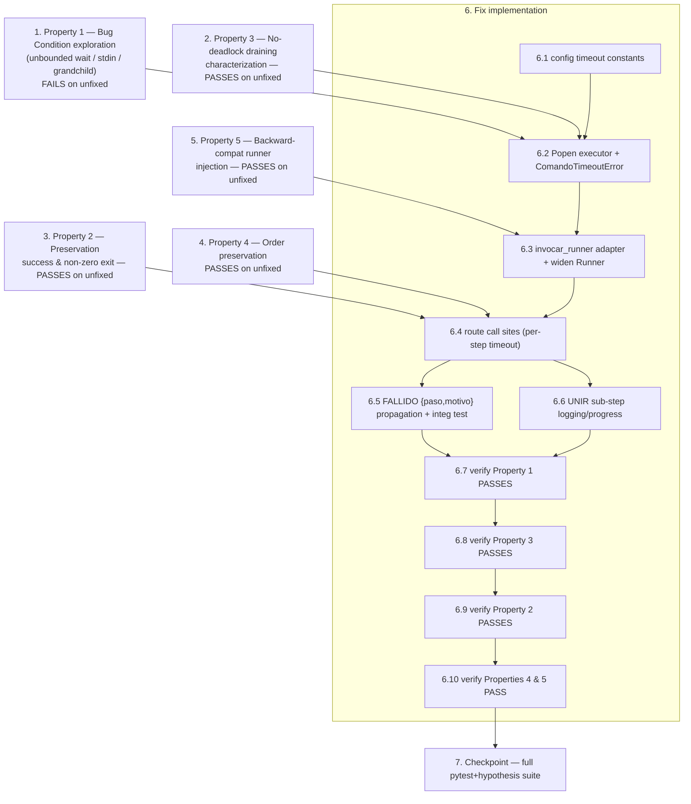

# Implementation Plan

> Bugfix: **UNIR step hang** — migrate the single external-tool subprocess funnel
> (`app/engine/proc.py::ejecutar_comando`) from an unbounded `subprocess.run`
> to a `Popen`-based executor that cannot silently hang (stdin from the null
> device, concurrent output draining, new session/process group, bounded timeout,
> process-group kill on expiry) and route every call site through a
> backward-compatible `Runner` adapter. Failures/timeouts propagate to the job
> `FALLIDO` state with `{paso, motivo}`, and UNIR sub-steps become observable.
>
> **Reminder (bug-condition methodology):** Tasks 1–5 write tests **BEFORE** any
> production change. Task 1 (Property 1) MUST **FAIL** on the UNFIXED code — that
> failure confirms the hang exists; do NOT try to fix the test or the code when
> it fails, and do NOT touch `proc.py` yet. Tasks 2–5 (Properties 2–5) are
> observation-first preservation baselines that MUST **PASS** on the UNFIXED
> code. Only after all five tests are written, run, and their expected outcomes
> documented do we implement the fix (Task 6).
>
> All new tests use `pytest` + `hypothesis` and go under `backend/tests/`.
> Every test that spawns a real child MUST be wrapped in a hard wall-clock guard
> (e.g. a watchdog thread / `pytest-timeout`-style cap enforced inside the test)
> so the suite itself can never hang while reproducing the bug. Real-subprocess
> tests are POSIX-oriented (session/process-group semantics); guard them with a
> `sys.platform`/`os.name` skip so standalone/local Windows runs are unaffected
> (Req 3.3).

---

- [x] 1. Write bug-condition exploration test for unbounded / non-terminating external-tool execution
  - **Property 1: Bug Condition** - Bounded, Non-Hanging Termination of External-Tool Steps
  - **CRITICAL**: This test MUST FAIL (hang → tripped by the harness wall-clock guard) on the UNFIXED code — the failure confirms the bug exists.
  - **DO NOT attempt to fix the test or `proc.py` when it fails.** This test encodes the expected bounded-termination behavior and will validate the fix once it passes after Task 6.
  - **GOAL**: Surface concrete counterexamples reproducing the "stuck at 25 %, zero output" symptom and confirm/refute the ranked root-cause hypotheses in design §"Hypothesized Root Cause".
  - **Scoped PBT approach**: this is a deterministic block, not a random one, so scope the Hypothesis property to the concrete blocking cases below (small strategies over tiny helper-script variants and requested-timeout values), each executed under a hard wall-clock cap that fails fast rather than hanging the suite.
  - Create `backend/tests/test_proc_timeout_pbt.py`. Drive `app.engine.proc.ejecutar_comando` (and, for one end-to-end case, `app.engine.ffprobe.inspeccionar_clip`) against a **real** child process (a tiny inline Python script invoked via `sys.executable -c`) for these cases from design §"Bug Details / Examples" and §"Exploratory Bug Condition Checking":
    - **1a Unbounded wait (headline)**: child sleeps far longer than any deadline; assert the call does not return within a generous wall-clock guard on unfixed code (reproduces the indefinite wait; `timeout=None` funnel).
    - **1b Blocked-on-inherited-stdin**: child reads `stdin` until EOF while the parent never writes/closes it; demonstrates the inherited-`stdin` stall (motivates `stdin=DEVNULL`).
    - **1c Grandchild survival**: child spawns a long-lived grandchild in the same group; demonstrates that terminating only the direct child is insufficient (motivates `start_new_session=True` + `os.killpg`).
  - Assert the post-fix contract the test will later enforce: with a bounded `timeout`, the call terminates within `timeout + grace`, raising `ComandoTimeoutError` (an `OSError` subclass) with an actionable message (command name, timeout value, captured `stderr` tail), and leaves no orphaned grandchild process.
  - Run on UNFIXED code. **EXPECTED OUTCOME**: FAILS (the guarded cases do not terminate / `ComandoTimeoutError` does not exist yet) — this proves the bug.
  - Document the observed counterexamples in the test module docstring (which case hung, whether a grandchild survived direct-child termination).
  - Mark complete when the test is written, run, and the failure is documented.
  - _Design refs: "Bug Details / Bug Condition + Examples", "Hypothesized Root Cause" (1–3), "Testing Strategy / Exploratory Bug Condition Checking", "Fix Checking"._
  - _Requirements: 1.1, 1.2, 1.5, 2.1, 2.2, 2.3, 2.6_

- [x] 2. Write no-deadlock concurrent-draining characterization test (invariant to preserve)
  - **Property 3: Preservation** - No-Deadlock Concurrent Output Draining
  - **IMPORTANT**: Observation-first. This characterizes CURRENT behavior so the `Popen` migration cannot regress into a real pipe-buffer deadlock (design §"Important root-cause honesty note").
  - **GOAL**: Confirm the current `subprocess.run`/`communicate()` funnel does NOT deadlock on large output, and pin that as a required invariant for the fixed executor.
  - In `backend/tests/test_proc_timeout_pbt.py` (or a sibling `test_proc_draining_pbt.py`), add a Hypothesis property that generates output sizes — including volumes far exceeding the ~64 KB OS pipe buffer (e.g. 0, 64 KB, several hundred KB) — and a choice of stream (`stdout`, `stderr`, or both). A real child writes exactly that many bytes to the chosen stream(s) and exits 0.
  - Assert: the executor returns without deadlock (under the wall-clock guard), `returncode == 0`, and the full byte count is captured on the corresponding stream(s).
  - Run on UNFIXED code. **EXPECTED OUTCOME**: PASSES (baseline invariant confirmed — no current deadlock).
  - Mark complete when written, run, and passing on unfixed code.
  - _Design refs: "Important root-cause honesty note", "Correctness Properties / Property 3", "Hypothesized Root Cause" (4), "Property-Based Tests / No-deadlock draining"._
  - _Requirements: 2.4_

- [x] 3. Write preservation property tests for non-buggy runner outcomes (success & non-zero exit)
  - **Property 2: Preservation** - Identical Behavior for Non-Buggy Inputs
  - **IMPORTANT**: Observation-first — observe outputs on UNFIXED code via injected `Runner` doubles, then encode them as properties.
  - **GOAL**: Lock in that tools returning within their deadline (and their error handling) are completely unaffected by the fix.
  - Create `backend/tests/test_unir_preservation_pbt.py`. Using injected doubles (no real binaries), add Hypothesis properties:
    - **3a Success equivalence**: a double returning `returncode=0` with generated `stdout`/`stderr` drives `normalize.unir_clips(...)` (hard-cut path, with a fake `inspector` returning a valid `ClipInfo`) to produce `unido.mp4`; assert the produced artifact, the written `concat.txt` contents, and the returned path are identical to the observed unfixed behavior.
    - **3b Non-zero exit equivalence**: a double returning non-zero still raises the same step-specific error (`NormalizacionError` from `unir_clips`, `ClipInspeccionError` from `inspeccionar_clip`) with the same `ruta`/`motivo`, and no partial `unido.mp4` is referenced as success.
  - Observe and record the concrete unfixed outputs in the module docstring before asserting.
  - Run on UNFIXED code. **EXPECTED OUTCOME**: PASSES (baseline behavior confirmed).
  - Mark complete when written, run, and passing on unfixed code.
  - _Design refs: "Expected Behavior / Preservation Requirements", "Correctness Properties / Property 2", "Preservation Checking", "Property-Based Tests / Preservation of successful runs"._
  - _Requirements: 3.1, 3.2, 3.3_

- [x] 4. Write order-preservation property test (unchanged concat order)
  - **Property 4: Preservation** - Order Preservation
  - **IMPORTANT**: Re-affirm the existing concat-order guarantee against the code paths the fix touches; reuse/extend the existing pure-order Hypothesis property (`normalize.contenido_concat_txt` / `parsear_concat_txt` round-trip) rather than duplicating it.
  - **GOAL**: Guarantee the fix never reorders, omits, or duplicates clips.
  - In `backend/tests/test_unir_preservation_pbt.py`, add a Hypothesis property over random `Orden_de_Clips` asserting that `contenido_concat_txt(orden)` parsed back with `parsear_concat_txt` equals `orden` element-for-element, and that a full `unir_clips` run (injected success double) writes intermediates in the exact user order.
  - Run on UNFIXED code. **EXPECTED OUTCOME**: PASSES.
  - Mark complete when written, run, and passing on unfixed code.
  - _Design refs: "Correctness Properties / Property 4", "Property-Based Tests / Order preservation"._
  - _Requirements: 3.6_

- [x] 5. Write backward-compatible runner-injection property test (single-arg doubles)
  - **Property 5: Preservation** - Backward-Compatible Runner Injection
  - **IMPORTANT**: Target the CALL SITES (not the not-yet-existing `invocar_runner`) so the test PASSES on unfixed code and continues to pass after the fix routes calls through the adapter.
  - **GOAL**: Guarantee single-argument injected doubles (`__call__(self, args)` / `def _cmd_ok(args)`) keep working without `TypeError` and return the same `ResultadoComando`.
  - In `backend/tests/test_unir_preservation_pbt.py`, add a Hypothesis property that generates injected `Runner` doubles of both shapes — single-arg (`args` only) and timeout-aware (`args, timeout=None`) — and asserts that `inspeccionar_clip(ruta, runner=double)` and `unir_clips(..., runner=double, inspector=...)` invoke the double with the same command args and obtain the same result, with no `TypeError`.
  - Run on UNFIXED code. **EXPECTED OUTCOME**: PASSES for the single-arg shape (current call sites use `runner(comando)`); the timeout-aware shape is exercised so the property is meaningful after the fix.
  - Mark complete when written, run, and passing on unfixed code.
  - _Design refs: "Correctness Properties / Property 5", "Fix Implementation / Change 2", "Property-Based Tests / Backward-compatible injection"._
  - _Requirements: 3.4, 3.5_

- [x] 6. Fix the UNIR-step hang: robust `Popen` executor, backward-compatible `Runner` contract, failure propagation, and UNIR observability

  - [x] 6.1 Add env-overridable subprocess timeout constants
    - In `app/config.py`, add `VSE_SUBPROCESS_TIMEOUT_S` (general default, e.g. 900 s), `VSE_PROBE_TIMEOUT_S` (short probe deadline, e.g. 60 s), and (optionally) a longer transcription/render default, each read from the environment with a numeric fallback — mirroring the existing `os.environ.get(...)` pattern for `VSE_*` settings.
    - Keep defaults generous so healthy runs on valid small inputs never trip them (Property 2 / slow-but-healthy edge case).
    - _Design refs: "Fix Implementation / Change 3"._
    - _Requirements: 2.2, 2.4, 3.1, 3.3_

  - [x] 6.2 Replace the executor in `proc.py` with a non-hanging `Popen`-based implementation
    - In `app/engine/proc.py`, add `class ComandoTimeoutError(OSError)` carrying an actionable message (command name, timeout value, captured `stderr` tail) and export it in `__all__`.
    - Rewrite `ejecutar_comando(args, timeout=None)` using `subprocess.Popen` with: `stdin=subprocess.DEVNULL`; `stdout=PIPE`, `stderr=PIPE`, `text=True`; `start_new_session=True` on POSIX (Windows fallback: `creationflags=CREATE_NEW_PROCESS_GROUP`); draining both streams concurrently via `proc.communicate(timeout=timeout)` (the no-deadlock invariant from Property 3, made explicit for the `Popen` migration).
    - On `subprocess.TimeoutExpired`: terminate the **whole process group** (`os.killpg(os.getpgid(proc.pid), SIGTERM)`, then `SIGKILL` after a short grace; Windows: `proc.kill()`), call `communicate()` again to drain remaining buffered output, and raise `ComandoTimeoutError`.
    - On success, return a byte-for-byte identical `ResultadoComando(returncode, stdout, stderr, args)` (Property 2).
    - _Design refs: "Fix Implementation / Change 1", "Hypothesized Root Cause" (1–4), "Unit Tests"._
    - _Bug_Condition: isBugCondition(X) = X.invokesExternalTool AND NOT X.enforcesBoundedTimeout_
    - _Expected_Behavior: bounded termination — succeed, or raise ComandoTimeoutError after process-group kill; never hang; no partial artifact as success_
    - _Requirements: 2.1, 2.2, 2.4, 2.6_

  - [x] 6.3 Add the backward-compatible `invocar_runner` adapter and widen the `Runner` contract
    - In `app/engine/proc.py`, widen the `Runner` type alias to `Callable[..., ResultadoComando]` (document the optional `timeout: Optional[float] = None` keyword) and export `invocar_runner`.
    - Implement `invocar_runner(runner, args, timeout)`: detect (via `inspect.signature`, cached, with a `TypeError` fallback) whether the runner accepts a `timeout` parameter; if so call `runner(args, timeout=timeout)`, otherwise call `runner(args)` exactly as today. This is the preservation-critical seam for single-arg doubles (Property 5).
    - _Design refs: "Fix Implementation / Change 2", "Correctness Properties / Property 5"._
    - _Preservation: single-arg runner doubles invoked identically to runner(args); timeout enforced only for timeout-aware runners_
    - _Requirements: 3.4, 3.5_

  - [x] 6.4 Route every engine call site through `invocar_runner` with a per-step timeout
    - Replace `resultado = runner(comando)` with `resultado = invocar_runner(runner, comando, timeout=<paso timeout>)` in: `ffprobe.py::inspeccionar_clip`; `normalize.py::_probar_duracion`, per-clip normalization, transitions, and concat; `silence.py` (`obtener_duracion`, `detectar_silencios`/silencedetect, recorte, `cortar_silencios`/auto-editor); and `transcribe.py`, `music.py`, `subtitles.py`, `risas.py`, `remotion.py`.
    - Use `VSE_PROBE_TIMEOUT_S` for `ffprobe` inspection/duration and `VSE_SUBPROCESS_TIMEOUT_S` (or the longer transcription/render default) elsewhere.
    - Leave the surrounding `try/except OSError` blocks unchanged so `ComandoTimeoutError` (an `OSError`) is wrapped into each step-specific error exactly as before.
    - _Design refs: "Fix Implementation / Change 2 (call-site list)"._
    - _Preservation: surrounding error handling unchanged; results identical for tools within deadline_
    - _Requirements: 2.2, 2.4, 3.1, 3.2_

  - [x] 6.5 Confirm timeout/failure propagation to the job `FALLIDO` state with `{paso, motivo}`
    - Verify (no new production code expected beyond `ComandoTimeoutError` deriving from `OSError`) that a timeout in a UNIR-step tool becomes `NormalizacionError`/`ClipInspeccionError` → `pipeline._fallo` → `EventoProgreso(FALLIDO, error={"paso": ..., "motivo": ...})` → `JobRunner.ejecutar_job` `marcar_fallido`.
    - Add an integration test (`backend/tests/test_unir_timeout_integracion.py`) driving `ejecutar_pipeline` with an injected runner/inspector that raises `ComandoTimeoutError` during UNIR, asserting the reporter receives `estado=FALLIDO`, `paso_actual=UNIR`, `error={"paso": "UNIR", "motivo": ...}`, that `ResultadoPipeline.exito is False`, and that no partial `unido.mp4` is referenced (Req 2.6).
    - _Design refs: "Fix Implementation / Change 5", "Integration Tests"._
    - _Requirements: 2.3, 2.6_

  - [x] 6.6 Add UNIR sub-step observability (logging + intermediate progress)
    - In `app/engine/normalize.py::unir_clips`, add `logger.info` markers before/after each sub-step (clip inspection, each per-clip normalization, concat/transitions) so a stall is visible in logs rather than silent (logging does not affect outputs — preservation-safe).
    - In `app/engine/pipeline.py`, optionally emit intermediate progress within the UNIR range (0–25 %) during multi-clip normalization, keeping the value monotonic non-decreasing per the JobManager contract.
    - _Design refs: "Fix Implementation / Change 4"._
    - _Requirements: 2.5_

  - [x] 6.7 Verify the bug-condition exploration test now passes
    - **Property 1: Expected Behavior** - Bounded, Non-Hanging Termination of External-Tool Steps
    - **IMPORTANT**: Re-run the SAME test from Task 1 — do NOT write a new test. It encodes the expected bounded-termination behavior.
    - Run `backend/tests/test_proc_timeout_pbt.py`. **EXPECTED OUTCOME**: PASSES — cases 1a–1c terminate promptly, `ComandoTimeoutError` is raised with an actionable message, and no orphaned grandchild survives.
    - _Design refs: "Fix Checking"._
    - _Requirements: 2.1, 2.2, 2.3, 2.6_

  - [x] 6.8 Verify the no-deadlock draining property still holds
    - **Property 3: Preservation** - No-Deadlock Concurrent Output Draining
    - **IMPORTANT**: Re-run the SAME test from Task 2 — do NOT write a new test.
    - **EXPECTED OUTCOME**: PASSES — the `Popen` executor drains large `stdout`/`stderr` concurrently without deadlock and captures full output.
    - _Requirements: 2.4_

  - [x] 6.9 Verify the non-buggy preservation properties still hold
    - **Property 2: Preservation** - Identical Behavior for Non-Buggy Inputs
    - **IMPORTANT**: Re-run the SAME tests from Task 3 — do NOT write new tests.
    - **EXPECTED OUTCOME**: PASSES — success equivalence and non-zero-exit equivalence unchanged after the fix.
    - _Requirements: 3.1, 3.2, 3.3_

  - [x] 6.10 Verify order preservation and backward-compatible injection still hold
    - **Property 4: Preservation** - Order Preservation
    - **Property 5: Preservation** - Backward-Compatible Runner Injection
    - **IMPORTANT**: Re-run the SAME tests from Tasks 4 and 5 — do NOT write new tests. Confirm single-arg doubles route through `invocar_runner` without `TypeError` and clip order is preserved.
    - **EXPECTED OUTCOME**: PASSES (no regressions).
    - _Requirements: 3.4, 3.5, 3.6_

- [x] 7. Checkpoint - full regression suite (pytest + hypothesis)
  - Run the complete `backend/` test suite (`pytest` with the existing `hypothesis` configuration) and confirm all pre-existing guarantees still pass — pure normalization math, order preservation, homogenization, command construction, injectable-runner behavior, silence/subtitles/remotion/render PBTs — alongside the new Property 1–5 tests.
  - Confirm standalone/local behavior is unaffected (POSIX-only real-subprocess tests are skipped where appropriate).
  - Ensure all tests pass; ask the user if any question arises.
  - _Requirements: 3.1, 3.2, 3.3, 3.4, 3.5, 3.6_

---

## Task Dependency Graph

**Dependency notes**
- Tasks 1–5 (all tests) come **before** any production change and can be written in parallel; Task 1 must FAIL and Tasks 2–5 must PASS on the UNFIXED code.
- `6.1` (config) feeds `6.2`; `6.2` (executor) is the structural root-cause fix and depends on the exploration/characterization insights from Tasks 1–2.
- `6.3` (adapter) depends on `6.2` and is validated by the Property 5 baseline (Task 5); `6.4` (call sites) depends on `6.3` and is validated by the Property 2/4 baselines (Tasks 3–4).
- `6.5` (failure propagation) and `6.6` (observability) depend on `6.4`.
- `6.7`–`6.10` re-run the SAME Task 1–5 tests to confirm the fix and no regressions, gating the Task 7 checkpoint.
