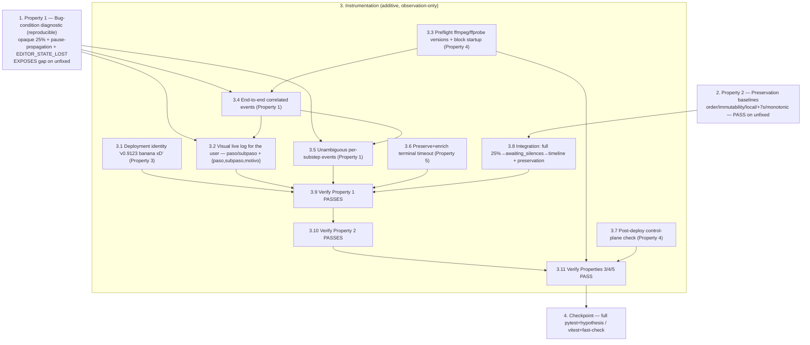

# Implementation Plan

> **Bugfix (iteration 2, diagnostic-first): UNIR / CORTAR_SILENCIOS opaque stall at 25%.**
> The first iteration already shipped the bounded-`Popen` executor (`editor/app/engine/proc.py`,
> `editor/app/config.py`), so the timeout hypothesis is **no longer a confirmed cause**. This
> iteration is **additive and observation-only**: it makes the transitions at the 25% boundary
> observable, carries a correlation tuple end-to-end, hardens deployment identity, and surfaces a
> **visual, live log for the user** so the failing step/substep is visible even while the
> percentage stays at 25%. It MUST NOT change pipeline outputs, ordering, immutability, local-mode
> behavior, or the isolation of the separate "+7 seconds" flow.
>
> **Bug-condition methodology (order is mandatory):**
> - **Task 1 (Property 1: Bug Condition)** is a reproducible diagnostic written **BEFORE** any
>   instrumentation. It MUST demonstrate — on the CURRENT code — that at 25% an observer cannot
>   distinguish `UNIR`-done vs detection-started vs pause-reached, and it MUST reproduce the
>   un-propagated pause and the `EDITOR_STATE_LOST` path. Do NOT fix code when it fails.
> - **Task 2 (Property 2: Preservation)** is observation-first: it MUST PASS on the CURRENT code and
>   pins the behavior that must not regress.
> - Only after Tasks 1–2 are written, run, and their outcomes documented do we instrument (Task 3).
>
> **Test locations (real):** Python → `editor/tests/` (`pytest` + `hypothesis`);
> TypeScript → `src/lib/edit/__tests__/`, `src/app/api/edit/__tests__/`, `src/components/edit/__tests__/`
> (`vitest` + `fast-check`). Every test that drives the boundary uses injected doubles (no real
> binaries) and a hard wall-clock cap so the suite can never hang. Real-subprocess/POSIX-only tests
> are guarded so standalone/local runs are unaffected (Req 3.3).

---

- [x] 1. Write the reproducible bug-condition diagnostic (exploratory checking) — BEFORE any instrumentation
  - **Property 1: Bug Condition** - Differentiated, Correlated Diagnosability at the 25% Boundary
  - **CRITICAL**: These tests MUST FAIL / expose the gap on the CURRENT code — the failure confirms the bug (opaque, un-classifiable 25%). **DO NOT** fix the code or the tests when they fail; they encode the expected post-fix behavior and will validate the instrumentation later.
  - **GOAL**: Surface concrete counterexamples proving that at 25% an observer cannot distinguish `UNIR`-done vs silence-detection-started vs pause-reached, and reproduce the pause-propagation gap and `EDITOR_STATE_LOST`. Confirm/refute the ranked hypotheses (strongest: C/D) from design §"Hypothesized Root Cause".
  - **Scoped PBT approach**: this is a deterministic diagnosability gap (not random), so scope the property to the concrete boundary cases below, each guarded by a hard wall-clock cap.
  - [x] 1.1 Python — opaque 25% boundary is indistinguishable
    - Create `editor/tests/test_stall_diagnostico_pbt.py`. Drive `app.engine.pipeline.ejecutar_pipeline` with silences enabled and injected `fn_unir`/`fn_detectar` doubles (no real binaries), capturing every `EventoProgreso` sent to the reporter.
    - Assert (on CURRENT code) that `UNIR`-done, `Detectando silencios` (start), detection-done, and `ESPERANDO_EDICION_SILENCIOS` all report **percentage 25** and carry **no** distinguishing step/substep/state/correlation metadata — i.e. the last confirmed event cannot place the job into exactly one of categories A/B/C/D (design §"Diagnostic Decision Matrix").
    - Document the observed indistinguishable event trail in the module docstring.
    - _Design refs: "Bug Details / Bug Condition + Examples", "Exploratory Bug Condition Checking" (case 1)._
    - _Requirements: 1.2, 1.3, 1.5_
  - [x] 1.2 TypeScript — pause propagation and EDITOR_STATE_LOST
    - Create `src/lib/edit/__tests__/stallDiagnostico.test.ts`. Drive `reconcileEditJob` (`src/lib/edit/jobReconciler.ts`) with an editor `/progreso` reporting estado `esperando_edicion_silencios`; assert it should map to `awaiting_silences` and that `controlForStatus("awaiting_silences") === "silence"` (timeline should mount) — recording where the current path fails to make the pause visible (category C).
    - Add a case where the editor returns 404 for a paused job and assert the current code surfaces `failed {paso:"EDITOR_STATE_LOST", motivo}` (reproduces the lost-editor-job propagation).
    - Document the reproduced counterexamples in the test file header.
    - _Design refs: "Examples / Category C", "Exploratory Bug Condition Checking" (cases 2–3)._
    - _Requirements: 1.1, 1.2, 1.3_
  - [x] 1.3 TypeScript — deployment identity ambiguity (category D)
    - In `src/app/api/edit/__tests__/` (or `src/components/edit/__tests__/`), add a test asserting that today there is **no** in-product coherence check tying the header identifier to `GET /api/version`, so a stale bundle (category D) is easy to misread. This test documents the gap that Task 3.1 closes.
    - **EXPECTED OUTCOME (Task 1 overall)**: tests expose the diagnosability gap on unfixed code. Mark complete when written, run, and the counterexamples are documented.
    - _Design refs: "Examples / Category D", "Exploratory Bug Condition Checking" (case 4)._
    - _Requirements: 1.6, 1.8_

- [x] 2. Write preservation baseline property tests (observation-first) — BEFORE any instrumentation
  - **Property 2: Preservation** - Identical Pipeline Behavior for Non-Buggy Inputs
  - **IMPORTANT**: Observe outputs on CURRENT code first, then encode them as properties. All of these MUST **PASS** on the unfixed code and pin what the instrumentation must not change.
  - [x] 2.1 Python — order/selection, immutability, pause semantics, monotonic percentage
    - In `editor/tests/` (extend an existing PBT module such as `test_ordering.py`/`test_pipeline.py` or add `test_preservacion_diagnostico_pbt.py`), add Hypothesis properties over random `orden_clips`: assert `contenido_concat_txt`/`parsear_concat_txt` round-trips element-for-element, `unir_clips` includes all and only the selected clips exactly once in order, source inputs are read-only (outputs/temporaries written to separate destinations), and progress percentage is monotonic non-decreasing while state/substep are independent of it.
    - _Design refs: "Preservation Requirements", "Preservation Checking", "Property-Based Tests / Order preservation"._
    - _Requirements: 3.1, 3.2, 3.6, 3.8_
  - [x] 2.2 Python/TS — local mode and +7s flow isolation
    - Add tests asserting local mode (`EDIT_MODE=local`, `VSE_STORAGE_BACKEND=local`) behaves independently of Cloud Run metadata, and that the separate "+7 seconds" clip-extension flow shares no triggers/states with the edit flow (both directions).
    - _Design refs: "Preservation Requirements / Flow isolation, Local mode", "Correctness Properties / Property 2"._
    - _Requirements: 3.3, 3.4, 3.7_
  - [x] 2.3 TS — statusMap and control mapping baseline
    - In `src/lib/edit/__tests__/`, assert `mapEditorEstado("esperando_edicion_silencios") === awaiting_silences`, an unknown estado maps to `failed {paso:"STATUS_MAPPING"}`, and `controlForStatus` yields the correct control for every reachable status. Confirm these PASS on unfixed code.
    - **EXPECTED OUTCOME (Task 2 overall)**: all baseline tests PASS on unfixed code. Mark complete when written, run, and passing.
    - _Design refs: "Glossary / statusMap", "Correctness Properties / Property 2"._
    - _Requirements: 3.1, 3.2, 3.3, 3.4, 3.6, 3.7, 3.8_

- [x] 3. Instrument the diagnostic-first fix (additive, observation-only)

  - [x] 3.1 Deployment identity next to `AUGC Pipeline` (priority 1)
    - In `src/app/layout.tsx`, render the exact manual identifier `v0.9123 banana xD` beside the `AUGC Pipeline` title, keeping the fixed bottom-right `VersionBanner` (`src/components/VersionBanner.tsx`) unchanged.
    - Bake the identifier **once** via env so it is inlined at build time and stays coherent with `getAppVersion()` (`src/lib/version.ts`) and `GET /api/version` (`src/app/api/version/route.ts`) for the same build/revision; **space-separate** the Docker image tag from the manual identifier (e.g. `"<image-tag> v0.9123 banana xD"`). Wire the build-arg through `Dockerfile` / `cloudbuild.yaml`.
    - Add `K_REVISION` to **server-side** diagnostics only (never rendered, no secrets).
    - Add coherence tests in `src/app/api/edit/__tests__/` (or equivalent): the header identifier equals the `GET /api/version` value and both correspond to the same build.
    - _Design refs: "Fix Implementation / Change 1", "Correctness Properties / Property 3"._
    - _Bug_Condition: category D — stale/mismatched revision undetectable in-product_
    - _Expected_Behavior: header shows `v0.9123 banana xD`, coherent with /api/version for the same build/revision (Property 3)_
    - _Requirements: 2.8, 2.9_

  - [x] 3.2 Visual live log for the user — show exactly what is failing (priority 2)
    - Extend the editor progress log in `src/components/edit/EditPanel.tsx` and `src/components/edit/editUiData.ts` so the play-by-play panel shows, live and legibly, the current **paso** and **subpaso** (not just percentage), and on failure renders the `{paso, subpaso, motivo}` plus a recommended action — so the user sees exactly what is failing **even while the percentage stays at 25%**.
    - Extend `EditProgressView`/`ProgressLogEntry` and `parseProgressResponse` to carry `subpaso`, `estado`, and any correlation identifiers (version/revision/`editJobId`/`editorJobId`) when present; keep `appendProgressLog` dedupe keyed on the meaningful tuple (so a substep change appends a new line even at the same percentage). Never render video content.
    - Add render tests in `src/components/edit/__tests__/` (and/or `editUiData` unit tests) asserting: substep changes at constant 25% append distinct visible log lines; a failed state renders `{paso, subpaso, motivo}` and the recommended action; correlation identifiers appear when provided.
    - _Design refs: "Fix Implementation / Change 4 (UI, timeline mount)", "Design strategy (3)", "Correctness Properties / Property 1"._
    - _Bug_Condition: user cannot see which step/substep is stuck at 25%_
    - _Expected_Behavior: live, human-readable step/substep + actionable {paso, subpaso, motivo}; state independent of percentage (Property 1)_
    - _Requirements: 2.2, 2.7, 3.8_

  - [x] 3.3 Editor preflight for `ffmpeg`/`ffprobe` with versions + structured logs (priority 3)
    - In `editor/app/deps/checker.py`, extend the checks so `ffmpeg`/`ffprobe` are not only located (`shutil.which`) but **executed** (`-version`) to capture and log their **versions** in a structured form, reusing the bounded `ejecutar_comando` (probe-sized timeout from existing `VSE_PROBE_TIMEOUT_S`); a failure marks the dependency unavailable.
    - In `editor/main.py` (lifespan), keep the existing "block startup on missing dependency" contract and ensure the failure message is actionable and correlated; do not publish partial results.
    - Add tests in `editor/tests/` (e.g. `test_deps.py`): preflight logs `ffmpeg`/`ffprobe` versions on success and blocks startup with an actionable message when a binary is missing/incompatible.
    - _Design refs: "Fix Implementation / Change 2", "Correctness Properties / Property 4"._
    - _Bug_Condition: category A/D — environment binaries/versions not verified on the effective revision_
    - _Expected_Behavior: preflight reports versions or blocks startup with actionable correlated failure (Property 4)_
    - _Requirements: 2.6_

  - [x] 3.4 End-to-end correlated events (priority 4)
    - Attach the correlation tuple `{version, revision (K_REVISION), editJobId, editorJobId, paso, subpaso, estado, eventType}` to every relevant log/event at job start, per substep, on pause, on timeout, and on failure across FastAPI: `editor/app/api/process.py`, `editor/app/api/progress.py`, `editor/app/jobs/runner.py`, `editor/app/jobs/manager.py`, `editor/app/engine/pipeline.py`, `editor/app/engine/normalize.py`, `editor/app/engine/silence.py`.
    - On the Next side, thread the same correlation through `src/lib/edit/jobReconciler.ts`, `src/lib/edit/statusMap.ts`, and the `src/app/api/edit/[editJobId]/progress` route. Keep percentage **monotonic** and **never** use it as the state. Never log video content (only ids, counts, durations, sizes, states).
    - Add unit tests (`editor/tests/`, `src/lib/edit/__tests__/`, `src/app/api/edit/__tests__/`) and a property test asserting step/substep/state may change while percentage stays 25 and remains monotonic, and that no video content is logged.
    - _Design refs: "Fix Implementation / Change 3", "Correctness Properties / Property 1"._
    - _Expected_Behavior: correlated differentiated events; state independent of percentage (Property 1)_
    - _Requirements: 2.1, 2.2, 2.5_

  - [x] 3.5 Unambiguous events for each substep (priority 5)
    - Emit distinct, correlated events for: bucket materialization; `ffprobe` per clip (start/done); per-clip normalization (start/done); concat (start/done); silence detection (start/done, segment count, duration); `marcar_esperando_edicion_silencios` (pause reached → `awaiting_silences`); reconciliation/state mapping (`reconcileEditJob`/`mapEditorEstado`, including `EDITOR_STATE_LOST`); and timeline mount in the UI.
    - Files: `editor/app/engine/normalize.py` (`unir_clips`), `editor/app/engine/silence.py` (`detectar_silencios`), `editor/app/engine/pipeline.py`, `editor/app/jobs/runner.py`, plus `src/lib/edit/jobReconciler.ts`/`statusMap.ts` and `EditPanel.tsx`.
    - Add unit tests asserting each substep emits its distinguishable correlated event.
    - _Design refs: "Fix Implementation / Change 4", "Diagnostic Decision Matrix", "Correctness Properties / Property 1"._
    - _Expected_Behavior: last confirmed event localizes the stall into exactly one of A/B/C/D (Property 1)_
    - _Requirements: 2.2, 2.3_

  - [x] 3.6 Preserve and enrich the terminal timeout failure (priority 6)
    - Keep the existing `ComandoTimeoutError` → step-specific error → `FALLIDO {paso, motivo}` chain unchanged in `editor/app/engine/pipeline.py` (`_fallo`) and `editor/app/jobs/runner.py`; **enrich** the motive with the substep and correlation tuple when missing so a terminal failure is immediately localizable. Do **not** introduce or assume new timeout values.
    - Add a test asserting an injected `ComandoTimeoutError` during UNIR yields `FALLIDO {paso:"UNIR", subpaso, motivo}` with correlation and no partial `unido.mp4` referenced as success.
    - _Design refs: "Fix Implementation / Change 5", "Correctness Properties / Property 5"._
    - _Preservation: existing Popen/timeout guarantees unchanged; no new timeout values (Property 5)_
    - _Requirements: 2.7, 3.5_

  - [x] 3.7 Post-deploy control-plane verification (priority 7)
    - Add a post-deploy verification step in `cloudbuild.yaml` (and/or a runbook in `DEPLOY.md`) that runs `gcloud run services describe` to confirm the live revision has CPU **always allocated** (`--no-cpu-throttling`), the expected image tag, and `min=max=1`; the step **fails the deploy** if any does not match. Never inferred from inside the container.
    - _Design refs: "Fix Implementation / Change 6", "Correctness Properties / Property 4"._
    - _Expected_Behavior: deploy fails unless control-plane matches expected settings (Property 4)_
    - _Requirements: 2.6_

  - [x] 3.8 Integration tests: full 25% → awaiting_silences → timeline transition + preservation (priority 8)
    - **Fix checking (Property 1)**: with injected doubles, drive the full transition end-to-end and assert the correlated event trail lets an observer classify the job and that `awaiting_silences` mounts `SilenceTimeline`. Python in `editor/tests/`, TS in `src/lib/edit/__tests__/` and `src/app/api/edit/__tests__/`.
    - **Preservation (Property 2)**: integration-level assertions for clip order/selection, input immutability, local mode, and +7s-flow separation remain unchanged after instrumentation.
    - _Design refs: "Integration Tests", "Fix Checking", "Preservation Checking"._
    - _Requirements: 2.1, 2.2, 2.3, 3.1, 3.2, 3.3, 3.4, 3.7_

  - [x] 3.9 Verify the bug-condition diagnostic now resolves
    - **Property 1: Expected Behavior** - Differentiated, Correlated Diagnosability at the 25% Boundary
    - **IMPORTANT**: Re-run the SAME tests from Task 1 — do NOT write new tests. **EXPECTED OUTCOME**: PASS — events are now differentiated and correlated, the job is classifiable into A/B/C/D, the pause propagates to the timeline (or a terminal actionable failure is shown), and state changes independently of the 25% percentage.
    - _Design refs: "Fix Checking"._
    - _Requirements: 2.1, 2.2, 2.3, 2.5_

  - [x] 3.10 Verify the preservation baselines still pass
    - **Property 2: Preservation** - Identical Pipeline Behavior for Non-Buggy Inputs
    - **IMPORTANT**: Re-run the SAME tests from Task 2 — do NOT write new tests. **EXPECTED OUTCOME**: PASS (no regressions) — order/selection, immutability, local mode, +7s isolation, pause semantics, and monotonic percentage unchanged.
    - _Requirements: 3.1, 3.2, 3.3, 3.4, 3.6, 3.7, 3.8_

  - [x] 3.11 Verify identity coherence, preflight, and terminal timeout properties
    - **Property 3: Deployment Identity Coherence** — header identifier equals `/api/version` for the same build (re-run Task 3.1 tests).
    - **Property 4: Preflight & Deploy-Time Environment Verification** — preflight logs versions/blocks startup (re-run Task 3.3 tests) and the post-deploy check fails on mismatch (Task 3.7).
    - **Property 5: Terminal Timeout Failure Preserved and Enriched** — timeout → `FALLIDO {paso, subpaso, motivo}` with correlation, no new timeout values (re-run Task 3.6 test).
    - **EXPECTED OUTCOME**: PASS.
    - _Requirements: 2.6, 2.7, 2.8, 2.9, 3.5_

- [x] 4. Checkpoint - run the full suites and confirm no regressions
  - Run the complete Python suite (`editor/` `pytest` + `hypothesis`) and the TypeScript suites (`vitest` + `fast-check`); confirm the Task 1 diagnostics now PASS, the Task 2 baselines still PASS, and all pre-existing guarantees hold. Confirm standalone/local behavior is unaffected (POSIX-only tests skipped where appropriate). Ask the user if any question arises.
  - _Requirements: 3.1, 3.2, 3.3, 3.4, 3.5, 3.6, 3.7, 3.8_

---

## Task Dependency Graph

**Dependency notes**
- Tasks **1–2 come before any instrumentation** and can be written in parallel; Task 1 must EXPOSE the diagnosability gap on unfixed code, Task 2 must PASS on unfixed code.
- Priority order inside Task 3 reflects the user emphasis: **3.1 deployment identity** and **3.2 the user-facing visual log** first (so "which build" and "what is failing at 25%" become visible), then preflight (3.3), correlated/per-substep events (3.4–3.5), terminal-failure enrichment (3.6), and the post-deploy check (3.7).
- `3.4` (correlation tuple) feeds `3.5` (per-substep events) and `3.2` (the log surfaces those correlated substeps); `3.3` establishes the environment truth the events reference.
- `3.8` writes the fix-checking + preservation integration tests; `3.9`–`3.11` re-run the SAME Task 1/2/3 tests to confirm the fix and the absence of regressions, gating the Task 4 checkpoint.
