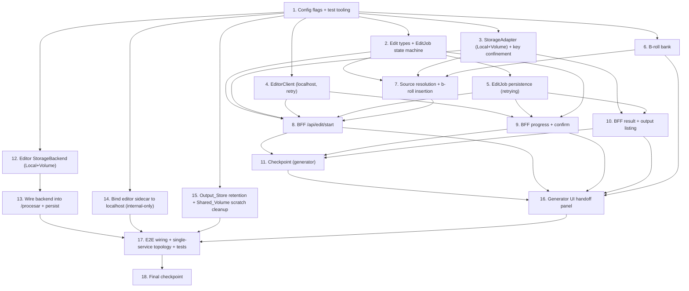

# Implementation Plan: video-editor-integration

## Overview

This plan implements the generator-editor integration described in `design.md`, grounded in the 11 requirements in `requirements.md`. It is organized as incremental, test-driven coding steps that build on one another and end by wiring everything into the generator UI and the editor pipeline.

**One repo, one Cloud Run service, two containers:** the editor's FastAPI code is brought into the `videogeneradorxd` repo and deployed as an **internal-only sidecar** alongside the Next.js generator (ingress) in **one** Cloud Run service; the two communicate over `http://127.0.0.1:<editor-port>` and exchange inputs over a **Shared_Volume** (`emptyDir`). Durable "download-later" outputs reuse videogeneradorxd's **existing GCS storage** (the Output_Store) — no new bucket, no cross-service auth.

**Correctness properties implemented:**
- P1 Order preservation · P2 Progress monotonicity · P3 Terminal consistency · P4 Standalone byte-for-byte round-trip invariance · P5 Isolation of failures · P6 Least-privilege key confinement / no traversal · P7 Editor isolation (editor reachable only over localhost, never exposed to ingress; the generator's existing app auth is the single front door).

**Mode discipline:** every new cloud path is gated behind `EDIT_MODE` / `VSE_STORAGE_BACKEND`, both defaulting to `local`, so standalone behavior is preserved (Req 10). There is no OIDC/service-to-service token code path.

---

## Tasks

- [ ] 1. Scaffold configuration flags and test tooling on both sides
- [ ] 2. Define generator edit domain types and the EditJob state machine
- [ ] 3. Implement the generator StorageAdapter (Local + Volume) with key confinement
- [ ] 4. Implement the generator EditorClient (localhost, retrying)
- [ ] 5. Implement EditJob persistence with retrying writes
- [ ] 6. Implement the b-roll bank (upload / list / select)
- [ ] 7. Implement source resolution and b-roll insertion into ordering
- [ ] 8. Implement the BFF start route (POST /api/edit/start)
- [ ] 9. Implement the BFF progress and confirm routes
- [ ] 10. Implement the BFF result and output-listing routes
- [ ] 11. Checkpoint — generator side
- [ ] 12. Implement the editor StorageBackend abstraction (Local + Volume)
- [ ] 13. Wire the StorageBackend into the editor /procesar path
- [ ] 14. Bind the editor sidecar to localhost only (internal-only, no OIDC)
- [ ] 15. Output retention (existing Output_Store lifecycle) + Shared_Volume scratch cleanup
- [ ] 16. Build the generator UI handoff panel
- [ ] 17. End-to-end wiring, single-service topology, and integration tests
- [ ] 18. Final checkpoint

---

## Task Dependency Graph

---

## Property → Task Coverage Map

| Property | Description | Task(s) |
|---|---|---|
| P1 | Order preservation | 7, 12 |
| P2 | Progress monotonicity | 2 |
| P3 | Terminal consistency | 10 |
| P4 | Standalone byte-for-byte round-trip invariance | 3, 12 |
| P5 | Isolation of failures | 5 |
| P6 | Least-privilege key confinement / no traversal | 3 |
| P7 | Editor isolation (localhost sidecar only, fronted by existing app auth) | 4, 9, 17 |

## Requirement → Task Coverage Map

| Requirement | Task(s) |
|---|---|
| 1 Hand off generated videos | 7, 8 |
| 2 Configure editing options | 8 |
| 3 Manage the b-roll bank | 6, 7 |
| 4 Insert b-roll into ordering | 2, 7 |
| 5 Track edit job progress | 2, 9 |
| 6 Persist edited output | 10, 12, 13, 15 |
| 7 Exchange files within the single service | 3, 12, 13, 15, 17 |
| 8 Reconcile job/progress models | 2, 5, 9 |
| 9 Isolate editor behind existing app auth | 3, 9, 14 |
| 10 Standalone operation | 1, 3, 12, 14, 17 |
| 11 Edit-job error handling | 4, 5, 8, 9 |

## Notes

- Property-based tests use **fast-check** (generator/TS) and **hypothesis** (editor/Python).
- Every cloud-only code path is gated behind `EDIT_MODE` / `VSE_STORAGE_BACKEND` (default `local`).
- The editor's 5-step engine, health check, dependency verification, and existing PBT suite remain unchanged in behavior — only I/O boundaries are abstracted.
